# Class Activity 1 — System Calls in Practice

- **Student Name:** [Your Name]
- **Student ID:** p20240044
- **Date:** 2025-07-10

---

## Warm-Up: Hello System Call

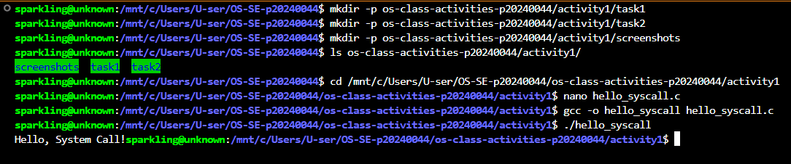

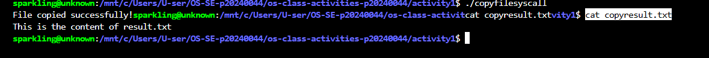

---

## Task 1: File Creator & Reader

### Part A — File Creator

**Describe your implementation:**
The library version uses fopen() and fprintf() which handle flags and
buffering automatically. The syscall version requires manually calling
open() with O_WRONLY, O_CREAT, O_TRUNC, then write() with the exact
byte count, then close(). Both produce identical output.

**Version A — Library Functions (file_creator_lib.c):**
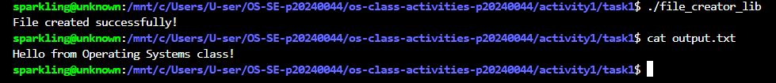

**Version B — POSIX System Calls (file_creator_sys.c):**
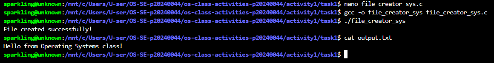

**Questions:**

1. **What flags did you pass to open()? What does each flag mean?**

   > I passed O_WRONLY | O_CREAT | O_TRUNC with mode 0644.
   > O_WRONLY = open the file for writing only.
   > O_CREAT = create the file if it does not already exist.
   > O_TRUNC = erase all existing content if the file already exists.

2. **What is 0644? What does each digit represent?**

   > 0644 is a Unix file permission number in octal format.
   > The leading 0 means it is octal notation.
   > 6 = owner can read and write (4+2=6).
   > 4 = group can only read.
   > 4 = everyone else can only read.

3. **What does fopen("output.txt", "w") do internally?**

   > fopen() automatically calls open() with O_WRONLY | O_CREAT |
   > O_TRUNC behind the scenes. It also allocates an internal memory
   > buffer in user space so small writes are batched before going to
   > the kernel. With open() I had to specify all three flags manually
   > and there is no automatic buffering.

### Part B — File Reader & Display

**Describe your implementation:**
The library version uses fgets() which reads one line at a time and
handles newlines automatically. The syscall version uses read() which
returns raw bytes and requires a while loop. Both display identical output.

**Version A — Library Functions (file_reader_lib.c):**
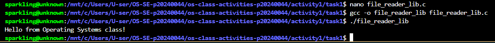

**Version B — POSIX System Calls (file_reader_sys.c):**
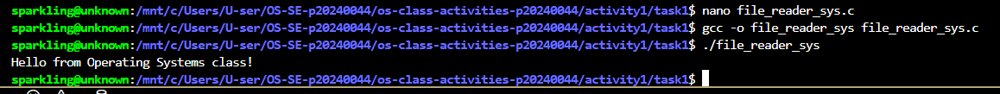

**Questions:**

1. **What does read() return? How is this different from fgets()?**

   > read() returns an integer — the number of bytes actually read.
   > It returns 0 at end of file and -1 on error. fgets() returns a
   > pointer to the buffer string or NULL at end of file. fgets() also
   > stops automatically at newline characters but read() reads raw
   > bytes and does not stop at newlines.

2. **Why do you need a loop when using read()? When does it stop?**

   > A loop is needed because read() only reads up to the buffer size
   > per call. If the file is larger than the buffer one call is not
   > enough. The loop stops when read() returns 0 meaning no more
   > data remains in the file.

---

## Task 2: Directory Listing & File Info

**Describe your implementation:**
The library version uses printf() to format and print each line.
The syscall version uses snprintf() to format into a buffer first
then write() to send it to the terminal. Output is identical.

### Version A — Library Functions (dir_list_lib.c)
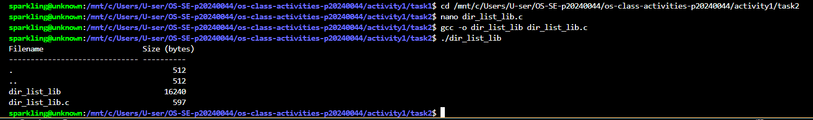

### Version B — System Calls (dir_list_sys.c)
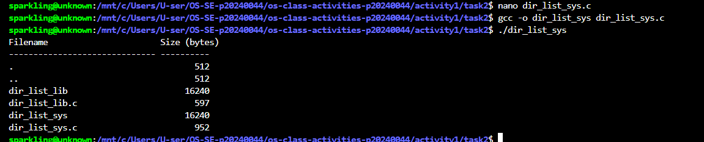

### Questions

1. **What struct does readdir() return? What fields does it contain?**

   > readdir() returns a pointer to struct dirent. Its important fields
   > are: d_name (the file name as a null-terminated string), d_ino
   > (the inode number), and d_type (file type: regular file or
   > directory).

2. **What information does stat() provide beyond file size?**

   > stat() provides: file type, permissions for owner/group/others,
   > number of hard links, owner user ID, group ID, last access time,
   > last modification time, last status change time, and device ID.

3. **Why can't you write() a number directly — why do you need snprintf() first?**

   > write() only works with raw text bytes. A number like 16240
   > stored as an integer is binary data in memory, not the characters
   > "16240". snprintf() converts the integer into a printable ASCII
   > string so write() can display it correctly on the terminal.

---

## Optional Bonus: Windows API (file_creator_win.c)

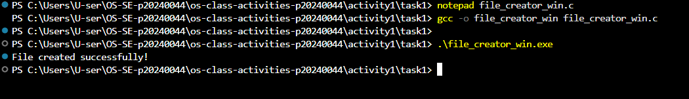

### Bonus Questions

1. **Why does Windows use HANDLE instead of integer file descriptors?**

   > Windows uses HANDLE because it is a general-purpose opaque
   > reference that can point to many different kernel objects such as
   > files, processes, threads, and mutexes all using the same type.
   > Linux uses small integers (file descriptors) which only refer to
   > open file descriptions in the process file table. HANDLE is more
   > flexible but less simple than integer file descriptors.

2. **What is the Windows equivalent of POSIX fork()? Why is it different?**

   > The Windows equivalent is CreateProcess(). POSIX fork() creates
   > a child by copying the parent process — the child starts with an
   > exact copy of the parent memory and continues from the same point
   > in code. Windows CreateProcess() always starts a completely new
   > program from a specified executable file. There is no way in
   > Windows to duplicate a running process the way fork() does.

3. **Can you use POSIX calls on Windows?**

   > Yes in two ways. WSL runs a real Linux kernel inside Windows so
   > full POSIX calls like open() write() and fork() work natively
   > inside WSL. Cygwin is a compatibility layer that translates POSIX
   > calls into Windows API calls allowing POSIX programs to compile
   > and run on Windows without WSL.

---

## Task 3: strace Analysis

**Describe what you observed:**
Running strace showed the library version makes many more system calls
than the direct syscall version. The library version loads libc.so.6,
sets up memory with mmap and brk, and uses fstat — all hidden overhead
that the syscall version completely avoids.

### strace Output — Library Version (File Creator)
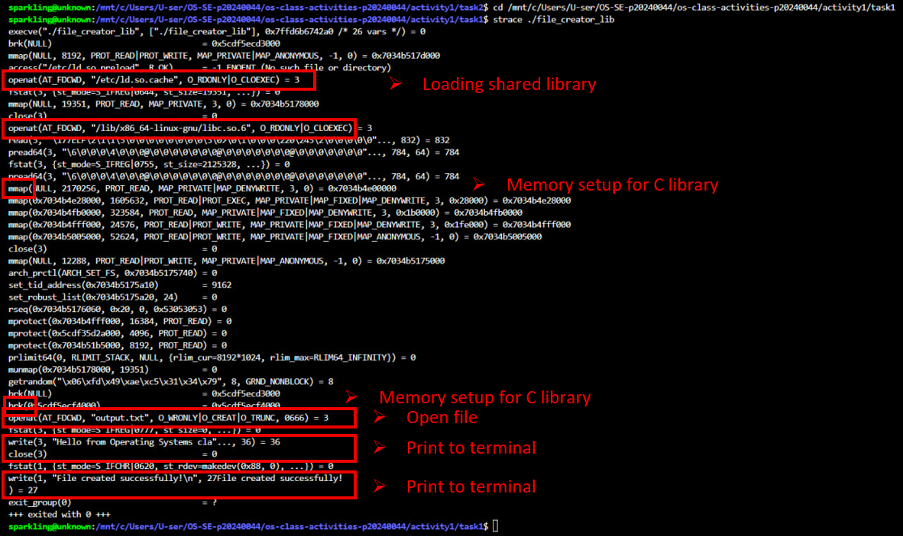

### strace Output — System Call Version (File Creator)
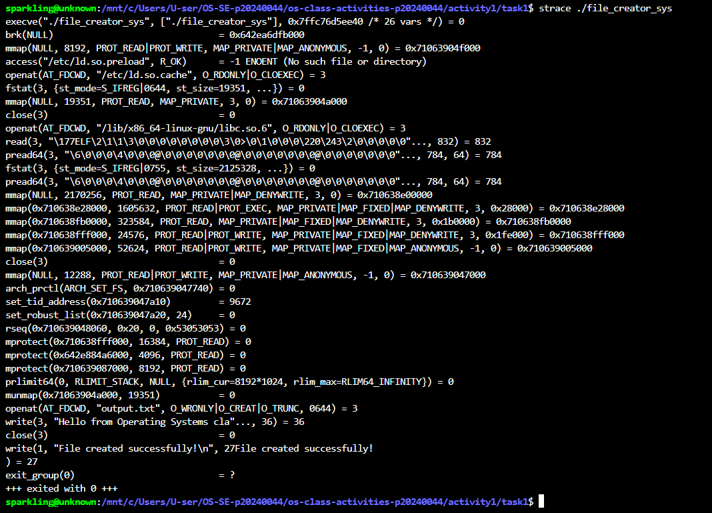

### strace Output — Library Version (File Reader)
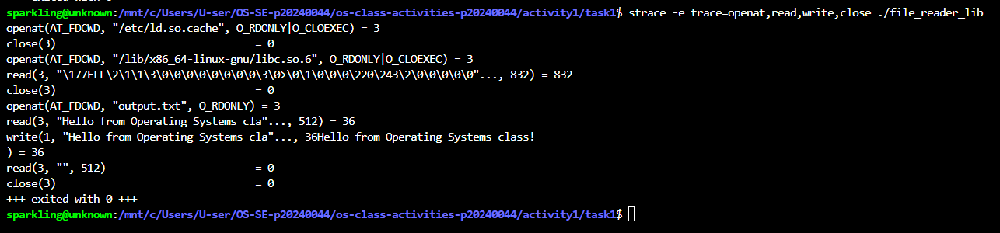

### strace Output — System Call Version (File Reader)
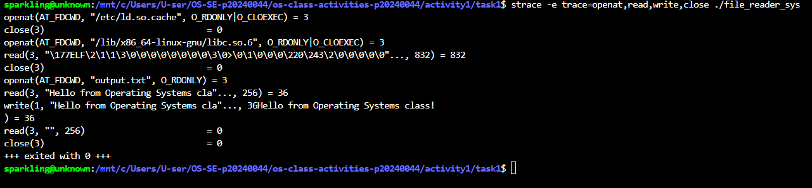

### strace -c Summary Comparison
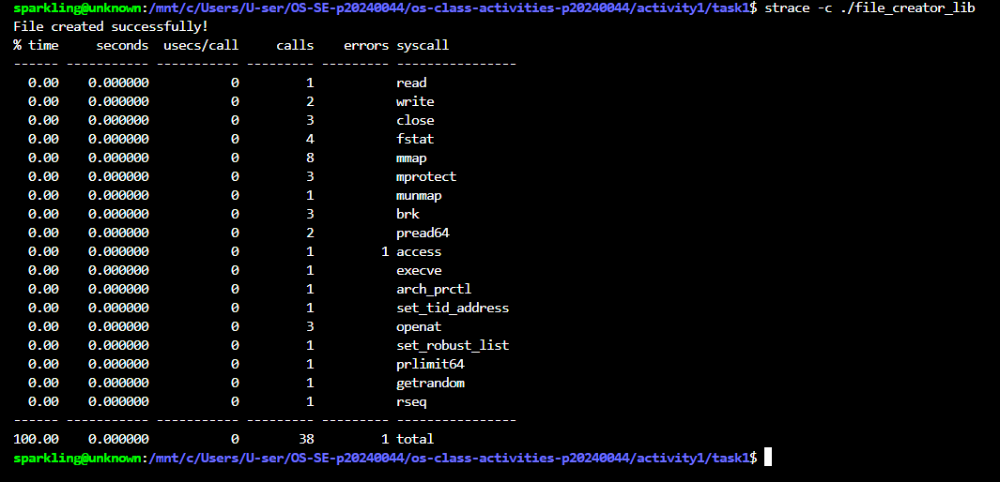
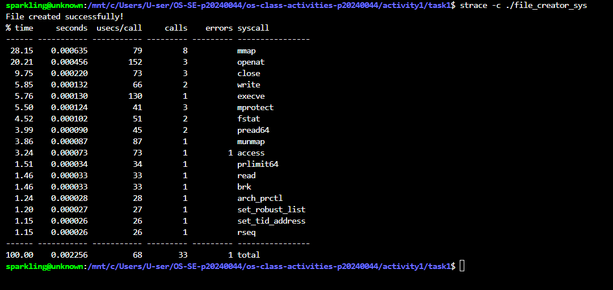

### Questions

1. **How many system calls does the library version make vs the syscall version?**

   > From strace -c: the library version (file_creator_lib) made 38
   > total system calls. The syscall version (file_creator_sys) made
   > 33 total system calls. The library version makes more calls
   > because of C library initialization overhead.

2. **What extra system calls appear in the library version?**

   > mmap (8 calls): maps memory regions for loading libc.so.6 into
   > the process address space.
   > fstat (4 calls): checks file status before reading, used by the
   > C library to prepare its internal I/O buffers.
   > brk (3 calls): adjusts heap memory boundary to allocate space
   > for the C library internal data structures.
   > pread64 (2 calls): reads from shared library files at a specific
   > position without changing the file pointer.
   > access (1 call): checks whether a library file exists before
   > trying to open it.

3. **How many write() calls does fprintf() actually produce?**

   > From strace output fprintf() produced only 1 actual write()
   > system call. The C library buffers output in memory and sends
   > everything to the kernel in a single write() call when the
   > buffer is flushed at program exit or fclose().

4. **What is the real difference between a library function and a system call?**

   > A library function like fprintf() or fopen() is code that runs
   > in user space and does extra work such as buffering and formatting
   > before eventually calling a real system call. A system call like
   > write() or open() is a direct request to the OS kernel where the
   > CPU switches from user mode to kernel mode. Library functions are
   > convenient wrappers — they are not kernel calls themselves.

---

## Task 4: Exploring OS Structure

### System Information
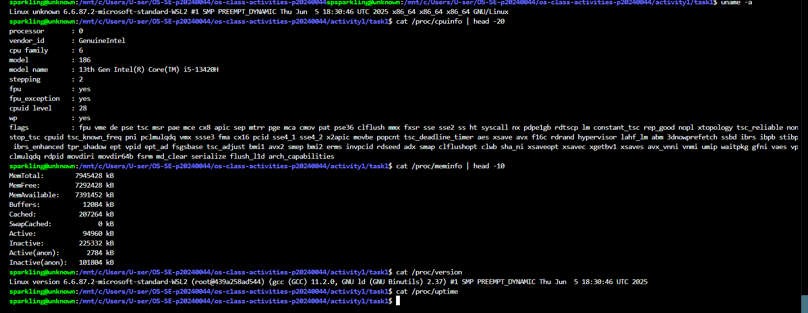

### Process Information
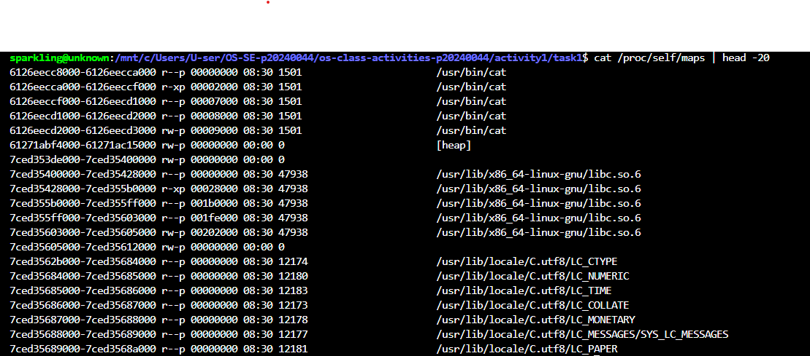

### Kernel Modules
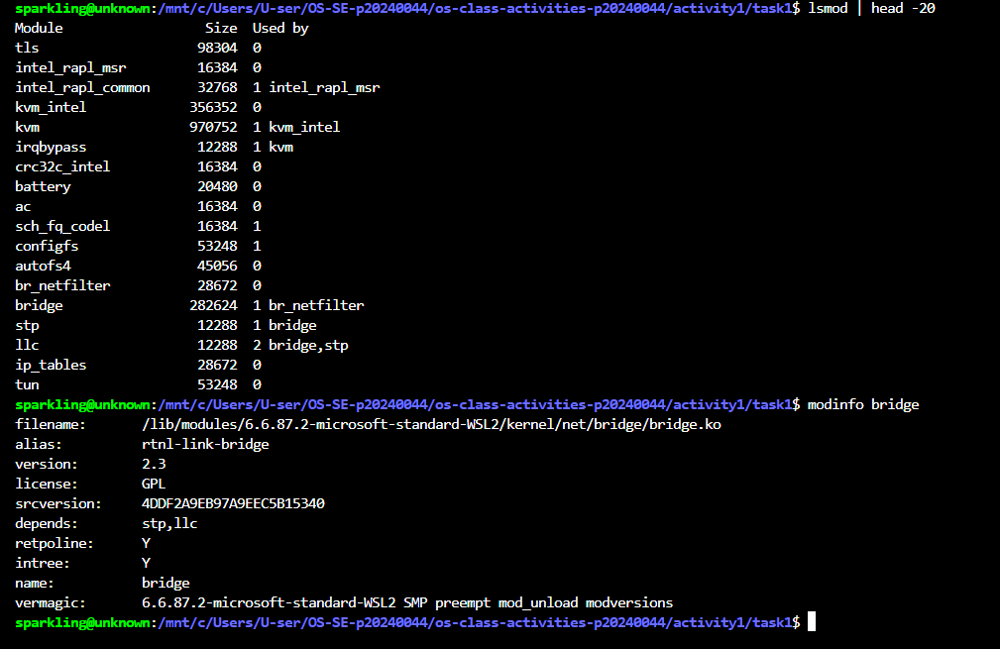

### OS Layers Diagram
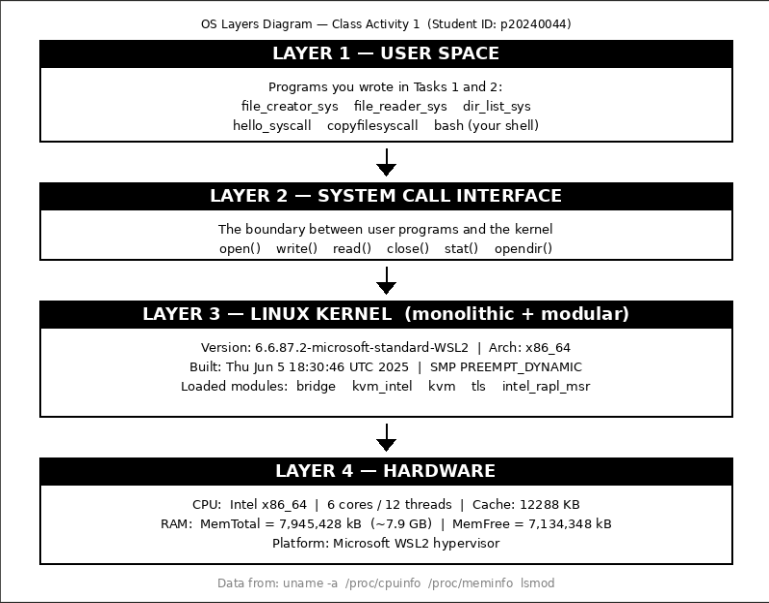

### Questions

1. **What is /proc? Is it a real filesystem on disk?**

   > /proc is not a real filesystem stored on disk. It is a virtual
   > filesystem that the Linux kernel creates entirely in memory. When
   > a program reads /proc/cpuinfo or /proc/meminfo the kernel
   > generates that content live from its internal data structures.
   > Nothing in /proc is ever written to the hard drive.

2. **Monolithic kernel vs microkernel — which type does Linux use?**

   > A monolithic kernel puts all OS services such as file systems
   > device drivers and networking inside one large kernel program in
   > kernel space. A microkernel keeps only the most essential
   > functions in the kernel and runs other services as separate
   > user-space processes.
   > Linux uses a monolithic kernel. However lsmod shows loaded
   > modules like bridge kvm_intel kvm and tls which can be added or
   > removed at runtime without rebooting. This makes Linux a modular
   > monolithic kernel.

3. **What memory regions do you see in /proc/self/maps?**

   > In /proc/self/maps I can see: shared library mappings such as
   > locale files C.utf8/LC_CTYPE and LC_NUMERIC mapped as read-only
   > pages, the program executable code loaded from disk, the heap
   > region where dynamic memory allocation happens, the stack where
   > local variables and function calls are stored, and the vdso
   > region which allows fast system calls without full kernel mode
   > switching.

4. **Break down the kernel version string from uname -a.**

   > Linux unknown 6.6.87.2-microsoft-standard-WSL2 #1 SMP
   > PREEMPT_DYNAMIC Thu Jun 5 18:30:46 UTC 2025 x86_64 GNU/Linux
   >
   > Linux = operating system name
   > unknown = hostname of this machine
   > 6.6.87.2 = kernel version (major 6, minor 6, patch 87, build 2)
   > microsoft-standard-WSL2 = custom name for Microsoft WSL2 build
   > #1 = build number 1 of this kernel configuration
   > SMP = Symmetric Multi-Processing, supports multiple CPU cores
   > PREEMPT_DYNAMIC = kernel can preempt tasks dynamically
   > Thu Jun 5 18:30:46 UTC 2025 = date and time kernel was compiled
   > x86_64 = 64-bit Intel or AMD CPU architecture

5. **How does /proc show that the OS is an intermediary?**

   > /proc shows the OS as intermediary because a user program cannot
   > read hardware information like CPU details or memory usage
   > directly. The program reads through /proc files which means it
   > asks the kernel. The kernel fetches the real data from hardware
   > registers and internal memory structures then returns it safely
   > through the /proc virtual file interface. The user program never
   > touches hardware directly — the kernel always stands in between.

---

## Reflection

Before this activity I did not understand the difference between
library functions and system calls. I always used printf() and
fopen() without thinking about what they do inside the OS. After
writing the syscall versions myself and running strace I can see
that printf() and fopen() are just wrappers that eventually call
write() and open() in the kernel.

The most surprising thing was seeing in strace -c that the library
version makes 38 system calls while my direct syscall version makes
33 even though both programs do exactly the same job. The extra
calls come from loading libc.so.6 into memory and setting up heap
space with brk and mmap.

The /proc filesystem was also very interesting. I expected it to be
real files on disk but learned it is generated live by the kernel in
memory. Reading /proc/cpuinfo gives CPU information without ever
touching hardware directly — the kernel always acts as the middle
layer between my program and the hardware.
