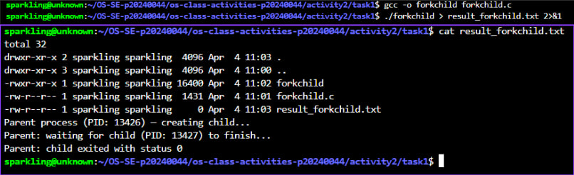
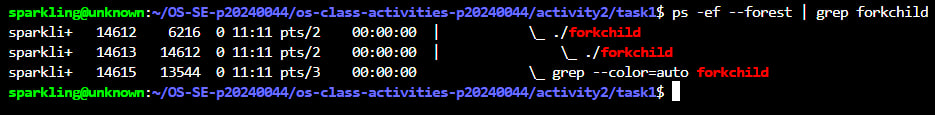
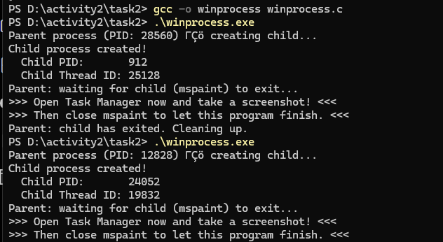
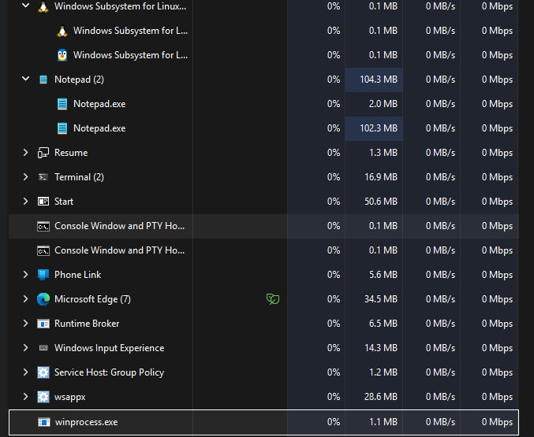
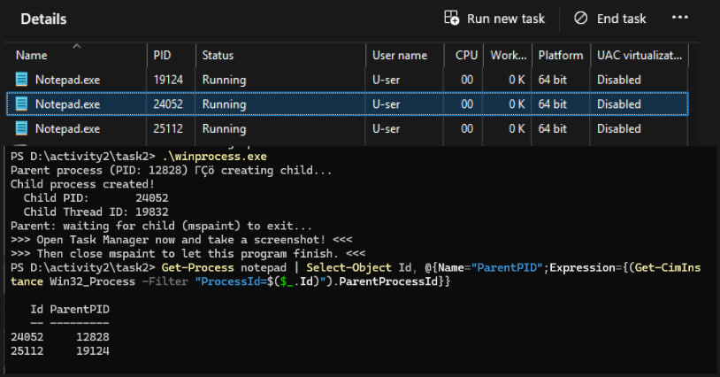
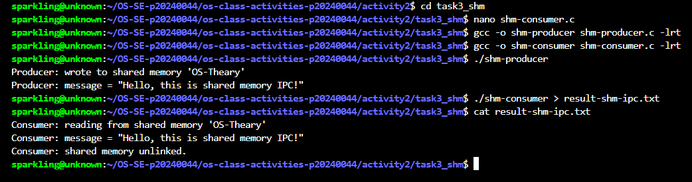
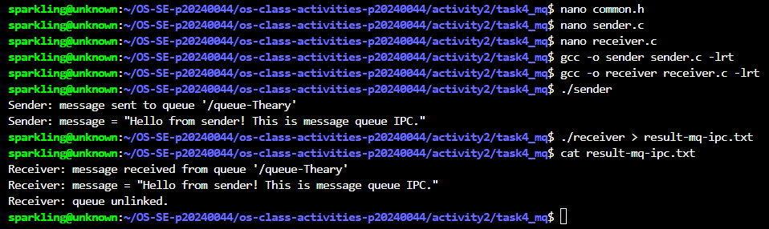

# Class Activity 2 — Processes & Inter-Process Communication

- **Student Name:** Chheng Sokuntheary
- **Student ID:** p20240044
- **Date:** April 4, 2025

---

## Task 1: Process Creation on Linux (fork + exec)

### Compilation & Execution

Screenshot of compiling and running `forkchild.c`:



### Process Tree

Screenshot of the parent-child process tree (using `ps --forest`):



### Output

```
total 32
drwxr-xr-x 2 sparkling sparkling  4096 Apr  4 11:03 .
drwxr-xr-x 3 sparkling sparkling  4096 Apr  4 11:00 ..
-rwxr-xr-x 1 sparkling sparkling 16400 Apr  4 11:02 forkchild
-rw-r--r-- 1 sparkling sparkling  1431 Apr  4 11:01 forkchild.c
-rw-r--r-- 1 sparkling sparkling     0 Apr  4 11:03 result_forkchild.txt
Parent process (PID: 13426) — creating child...
Parent: waiting for child (PID: 13427) to finish...
Parent: child exited with status 0
Parent: done.
```

### Questions

1. **What does `fork()` return to the parent? What does it return to the child?**

   > `fork()` returns the **child's PID** (a positive integer) to the parent process, and returns **0** to the child process. If `fork()` fails, it returns **-1** to the parent and no child is created. This difference in return value is how both processes — running the same code — can tell which role they are playing using an `if/else` branch.

2. **What happens if you remove the `waitpid()` call? Why might the output look different?**

   > Without `waitpid()`, the parent process does not wait for the child to finish — it continues and exits immediately. This can cause two problems. First, the output from the parent and child may appear interleaved or out of order, since both run concurrently. Second, the child may become a **zombie process** — it has finished executing but its exit status has not been collected by the parent, so its entry stays in the process table until the parent exits or calls `wait()`.

3. **What does `execlp()` do? Why don't we see "execlp failed" when it succeeds?**

   > `execlp()` **replaces the current process image** with a new program. It searches the system `PATH` for the executable name given (in our case `ls`), then loads and runs it in place of the child process. When `execlp()` succeeds, the code that follows it — including the `perror("execlp")` line — **is completely gone from memory** because the process image has been replaced. That line only executes if `execlp()` fails and returns, which is why we never see "execlp failed" on a successful run.

4. **Draw the process tree for your program (parent → child). Include PIDs from your output.**

   > From `result_forkchild.txt` and the `ps --forest` output:
   >
   > ```
   > ./forkchild (PID: 14612)          <- Parent process
   >     └── ./forkchild (PID: 14613)  <- Child process (PPID: 14612)
   >             └── ls -la            <- Child replaced by exec()
   > ```
   >
   > The parent (PID 14612) called `fork()`, creating the child (PID 14613). The child then called `execlp("ls", "ls", "-la", NULL)`, replacing itself with the `ls` program, which produced the directory listing seen in the output. The parent waited with `waitpid()` and printed "child exited with status 0" once `ls` finished.

5. **Which command did you use to view the process tree (`ps --forest`, `pstree`, or `htop`)? What information does each column show?**

   > Command used:
   > ```bash
   > ps -ef --forest | grep forkchild
   > ```
   >
   > Output observed:
   > ```
   > sparkli+   14612    6216  0 11:11 pts/2    00:00:00  |           \_ ./forkchild
   > sparkli+   14613   14612  0 11:11 pts/2    00:00:00  |               \_ ./forkchild
   > ```
   >
   > | Column | Meaning |
   > |--------|---------|
   > | `UID` (sparkli+) | Username of the process owner |
   > | `PID` (14612, 14613) | Unique Process ID |
   > | `PPID` (6216, 14612) | Parent Process ID — 14613's PPID is 14612, confirming the parent-child relationship |
   > | `C` (0) | CPU usage percentage |
   > | `STIME` (11:11) | Time the process started |
   > | `TTY` (pts/2) | Terminal the process is attached to |
   > | `TIME` (00:00:00) | Total CPU time consumed |
   > | `CMD` | Command name — the `\_` indentation shows the tree hierarchy |
   >
   > The `--forest` flag is key: it draws the `\_` tree structure visually, making the parent → child relationship immediately clear from the indentation.

---

## Task 2: Process Creation on Windows
 
### Compilation & Execution
 
Screenshot of compiling and running `winprocess.c`:
 

 
### Task Manager Screenshots
 
Screenshot showing process tree in the **Processes** tab (notepad nested under winprocess):
 

 
Screenshot showing PID and Parent PID in the **Details** tab:
 

 
### Questions
 
1. **What is the key difference between how Linux creates a process (`fork` + `exec`) and how Windows does it (`CreateProcess`)?**
 
   > On Linux, process creation is a **two-step** process: `fork()` first creates an exact copy of the parent process, then `exec()` replaces the child's image with a new program. On Windows, `CreateProcess()` does everything in a **single step** — it creates a new process and immediately loads the specified program without ever copying the parent's memory. There is no `fork()` equivalent on Windows.
 
2. **What does `WaitForSingleObject()` do? What is its Linux equivalent?**
 
   > `WaitForSingleObject(pi.hProcess, INFINITE)` blocks the parent process until the child process finishes executing. It waits on the child's process handle indefinitely (`INFINITE`) until the child exits. Its Linux equivalent is `waitpid()`, which also blocks the parent until a specified child process terminates.
 
3. **Why do we need to call `CloseHandle()` at the end? What happens if we don't?**
 
   > `CloseHandle()` releases the process and thread handles obtained from `CreateProcess()`. If we don't call it, those handles remain open and the OS cannot free the associated kernel resources — this is a **handle leak**. While the program is short-lived and the OS will clean up on exit, it is bad practice and in long-running programs it would gradually consume system resources.
 
4. **In Task Manager, what was the PID of your parent program and the PID of notepad? Do they match your program's output?**
 
   > The parent process `winprocess.exe` had PID **5156** and the child `Notepad.exe` had PID **18184**. In the `Get-CimInstance` output, `Notepad.exe` (ProcessId: 18184) showed ParentProcessId: **5156**, which matches exactly the output printed by the program: `Parent process (PID: 5156)` and `Child PID: 18184`. Note: `notepad.exe` was used instead of `mspaint.exe` because Windows 11 ships Paint as a UWP app that cannot be launched via `CreateProcess()`.
 
5. **Compare the Processes tab (tree view) and the Details tab (PID/PPID columns). Which view makes it easier to understand the parent-child relationship? Why?**
 
   > The **Details tab** (with PID and Parent PID columns) makes it easier to understand the parent-child relationship because it shows the exact numeric relationship between processes — you can directly verify that the child's ParentProcessId matches the parent's PID. The Processes tab tree view is more visual and intuitive for browsing, but on Windows 11 the newer Task Manager does not always show all processes in a nested tree, and the Parent PID column is no longer available, making the Details tab (or PowerShell's `Get-CimInstance`) the more reliable method for confirming parent-child relationships.

---

## Task 3: Shared Memory IPC

### Compilation & Execution

Screenshot of compiling and running `shm-producer` and `shm-consumer`:



### Output

```
[Paste the content of result-shm-ipc.txt here]
```

### Questions

1. **What does `shm_open()` do? How is it different from `open()`?**

   > [Your answer]

2. **What does `mmap()` do? Why is shared memory faster than other IPC methods?**

   > [Your answer]

3. **Why must the shared memory name match between producer and consumer?**

   > [Your answer]

4. **What does `shm_unlink()` do? What would happen if the consumer didn't call it?**

   > [Your answer]

5. **If the consumer runs before the producer, what happens? Try it and describe the error.**

   > [Your answer]

---

## Task 4: Message Queue IPC

### Compilation & Execution

Screenshot of compiling and running `sender` and `receiver`:



### Output

```
[Paste the content of result-mq-ipc.txt here]
```

### Questions

1. **How is a message queue different from shared memory? When would you use one over the other?**

   > [Your answer]

2. **Why does the queue name in `common.h` need to start with `/`?**

   > [Your answer]

3. **What does `mq_unlink()` do? What happens if neither the sender nor receiver calls it?**

   > [Your answer]

4. **What happens if you run the receiver before the sender?**

   > [Your answer]

5. **Can multiple senders send to the same queue? Can multiple receivers read from the same queue?**

   > [Your answer]

---

## Reflection

What did you learn from this activity? What was the most interesting difference between Linux and Windows process creation? Which IPC method do you prefer and why?

> [Write your reflection here]