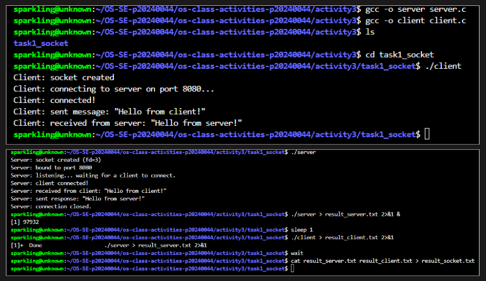
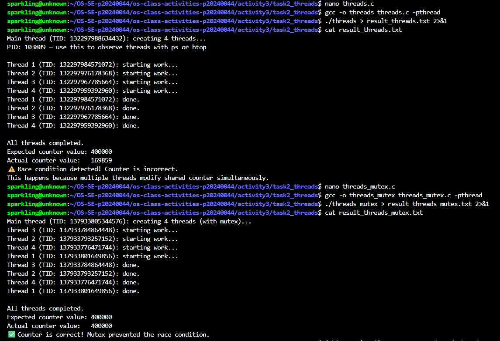
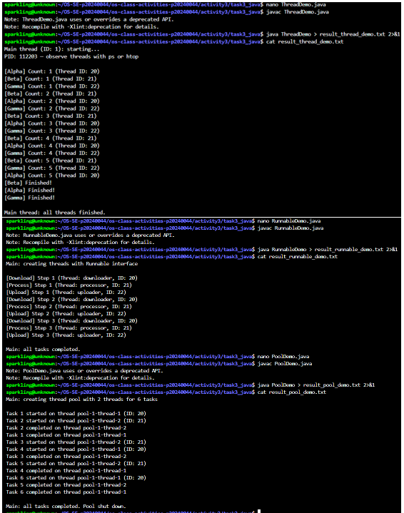
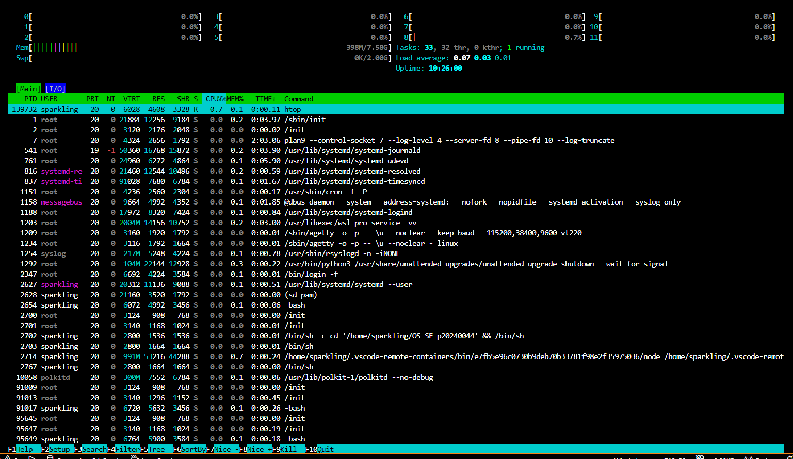
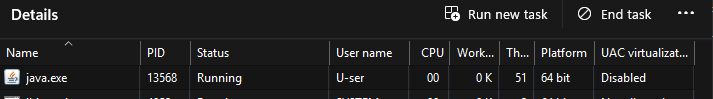

# Class Activity 3 — Socket Communication & Multithreading

- **Student Name:** Chheng Sokuntheary
- **Student ID:** p20240044
- **Date:** April 4, 2026

---

## Task 1: TCP Socket Communication (C)

### Compilation & Execution



### Output

```
Server: socket created (fd=3)
Server: bound to port 8080
Server: listening... waiting for a client to connect.
Server: client connected!
Server: received from client: "Hello from client!"
Server: sent response: "Hello from server!"
Server: connection closed.
Client: socket created
Client: connecting to server on port 8080...
Client: connected!
Client: sent message: "Hello from client!"
Client: received from server: "Hello from server!"
Client: connection closed.
```

### Answers

1. **Role of `bind()` / Why client doesn't call it:**

   > `bind()` assigns a specific IP address and port number to the server socket so that clients know where to connect. The server must call `bind()` because it needs to advertise a well-known address that clients can reach. The client does not call `bind()` because it does not need a fixed address — the OS automatically assigns it a temporary (ephemeral) port when it calls `connect()`. Clients initiate connections, so their port number does not need to be known in advance.

2. **What `accept()` returns:**

   > `accept()` blocks until a client connects, then returns a **new socket file descriptor** specifically for that client connection. This new socket is different from the original server socket — the server socket (`server_fd`) continues listening for new connections, while the new socket (`client_fd`) is used exclusively to communicate with the connected client. This separation allows the server to handle multiple clients simultaneously.

3. **Starting client before server:**

   > If the client runs before the server, `connect()` fails immediately because there is nothing listening on port 8080 yet. The error output is:
   > ```
   > connect: Connection refused
   > ```
   > The client exits with an error. The server must always be started first and must be in the `listen()` state before the client calls `connect()`.

4. **What `htons()` does:**

   > `htons()` stands for "host to network short" — it converts a 16-bit port number from the host's byte order to **network byte order** (big-endian). Different CPU architectures store multi-byte numbers differently (e.g., x86 uses little-endian). Network protocols use big-endian by convention, so byte order conversion is needed to ensure both sides of a connection interpret the port number the same way regardless of the hardware they run on.

5. **Socket call sequence diagram:**

   > ```
   > SERVER                          CLIENT
   > ------                          ------
   > socket()                        socket()
   >    |                               |
   > bind()                             |
   >    |                               |
   > listen()                           |
   >    |                               |
   > accept() <---- TCP Handshake ---- connect()
   >    |                               |
   > read/recv() <------ data -------- send()
   >    |                               |
   > send() --------- data ---------> read/recv()
   >    |                               |
   > close()                         close()
   > ```

---

## Task 2: POSIX Threads (C)

### Output — Without Mutex (Race Condition)



### Output — With Mutex (Correct)

_(Included in the same screenshot)_

### Output (Race Condition)

```
Main thread (TID: 132297988634432): creating 4 threads...
PID: 103809 — use this to observe threads with ps or htop

Thread 1 (TID: 132297984571072): starting work...
Thread 2 (TID: 132297976178368): starting work...
Thread 3 (TID: 132297967785664): starting work...
Thread 4 (TID: 132297959392960): starting work...
Thread 1 (TID: 132297984571072): done.
Thread 2 (TID: 132297976178368): done.
Thread 3 (TID: 132297967785664): done.
Thread 4 (TID: 132297959392960): done.

All threads completed.
Expected counter value: 400000
Actual counter value:   169859
⚠️  Race condition detected! Counter is incorrect.
This happens because multiple threads modify shared_counter simultaneously.
```

### Output (With Mutex)

```
Main thread (TID: 137933805344576): creating 4 threads (with mutex)...
Thread 3 (TID: 137933784864448): starting work...
Thread 2 (TID: 137933793257152): starting work...
Thread 4 (TID: 137933776471744): starting work...
Thread 1 (TID: 137933801649856): starting work...
Thread 3 (TID: 137933784864448): done.
Thread 2 (TID: 137933793257152): done.
Thread 4 (TID: 137933776471744): done.
Thread 1 (TID: 137933801649856): done.

All threads completed.
Expected counter value: 400000
Actual counter value:   400000
✅ Counter is correct! Mutex prevented the race condition.
```

### Answers

1. **What is a race condition?**

   > A race condition occurs when two or more threads access and modify a shared variable at the same time without synchronization, producing unpredictable results. In `threads.c`, all 4 threads increment `shared_counter` simultaneously. The increment operation (`shared_counter++`) is not atomic — it involves three steps: read, add, and write. When two threads read the same value before either has written back, one update is lost. This is why the actual counter (169859) is much less than the expected value (400000).

2. **What does `pthread_mutex_lock()` do? Why does it fix the race condition?**

   > `pthread_mutex_lock()` acquires a mutex lock before the critical section, blocking any other thread that tries to lock the same mutex until the current thread calls `pthread_mutex_unlock()`. This ensures only one thread can execute `shared_counter++` at a time — making the increment atomic from the perspective of the threads. By serializing access to the shared variable, the mutex eliminates the race condition and guarantees the counter reaches exactly 400000.

3. **What happens if you forget to call `pthread_join()`?**

   > Without `pthread_join()`, the main thread does not wait for the worker threads to finish — it reaches `return 0` and exits immediately, terminating the entire process. All threads that haven't finished are killed abruptly. The output will be incomplete or missing entirely since the threads never get to print their results. The final counter value may also be 0 or incorrect because the threads had no time to run.

4. **How is a thread different from a process? What do threads share and what is private?**

   > A process is an independent program with its own separate memory space, file descriptors, and OS resources. A thread is a lighter unit of execution that lives inside a process. Threads within the same process **share**: code segment, data segment, heap memory, open file descriptors, and global variables. Each thread has its own **private**: stack, registers, program counter, and thread ID. Because threads share memory, communication between them is fast but requires synchronization (e.g., mutexes) to avoid race conditions. Processes are isolated, so IPC mechanisms like shared memory or message queues are needed to communicate between them.

---

## Task 3: Java Multithreading

### ThreadDemo Output



### ThreadDemo Output

```
Main thread (ID: 1): starting...
PID: 112203 — observe threads with ps or htop

[Alpha] Count: 1 (Thread ID: 20)
[Beta] Count: 1 (Thread ID: 21)
[Gamma] Count: 1 (Thread ID: 22)
[Beta] Count: 2 (Thread ID: 21)
[Alpha] Count: 2 (Thread ID: 20)
[Gamma] Count: 2 (Thread ID: 22)
[Beta] Count: 3 (Thread ID: 21)
[Alpha] Count: 3 (Thread ID: 20)
[Gamma] Count: 3 (Thread ID: 22)
[Beta] Count: 4 (Thread ID: 21)
[Alpha] Count: 4 (Thread ID: 20)
[Gamma] Count: 4 (Thread ID: 22)
[Beta] Count: 5 (Thread ID: 21)
[Gamma] Count: 5 (Thread ID: 22)
[Alpha] Count: 5 (Thread ID: 20)
[Beta] Finished!
[Alpha] Finished!
[Gamma] Finished!

Main thread: all threads finished.
```

### RunnableDemo Output

```
Main: creating threads with Runnable interface

[Download] Step 1 (Thread: downloader, ID: 20)
[Process] Step 1 (Thread: processor, ID: 21)
[Upload] Step 1 (Thread: uploader, ID: 22)
[Download] Step 2 (Thread: downloader, ID: 20)
[Process] Step 2 (Thread: processor, ID: 21)
[Upload] Step 2 (Thread: uploader, ID: 22)
[Download] Step 3 (Thread: downloader, ID: 20)
[Process] Step 3 (Thread: processor, ID: 21)
[Upload] Step 3 (Thread: uploader, ID: 22)

Main: all tasks completed.
```

### PoolDemo Output

```
Main: creating thread pool with 2 threads for 6 tasks

Task 1 started on thread pool-1-thread-1 (ID: 20)
Task 2 started on thread pool-1-thread-2 (ID: 21)
Task 2 completed on thread pool-1-thread-2
Task 1 completed on thread pool-1-thread-1
Task 3 started on thread pool-1-thread-2 (ID: 21)
Task 4 started on thread pool-1-thread-1 (ID: 20)
Task 3 completed on thread pool-1-thread-2
Task 5 started on thread pool-1-thread-2 (ID: 21)
Task 4 completed on thread pool-1-thread-1
Task 6 started on thread pool-1-thread-1 (ID: 20)
Task 5 completed on thread pool-1-thread-2
Task 6 completed on thread pool-1-thread-1

Main: all tasks completed. Pool shut down.
```

### Answers

1. **What is the difference between extending `Thread` and implementing `Runnable`?**

   > Extending `Thread` means creating a subclass of `Thread` and overriding `run()` directly — the class itself is the thread. Implementing `Runnable` separates the task from the thread — the `run()` logic is defined in a `Runnable` object, which is then passed to a `Thread` constructor. `Runnable` is preferred in most cases because Java only allows single inheritance, so if a class already extends another class it cannot also extend `Thread`. `Runnable` also promotes better design by separating the task logic from thread management, and works naturally with `ExecutorService`.

2. **In `PoolDemo`, why do only 2 tasks run simultaneously even though 6 are submitted?**

   > The pool was created with `Executors.newFixedThreadPool(2)`, which limits the number of active threads to 2. When all 6 tasks are submitted, only 2 can run at a time — the remaining 4 wait in an internal queue. As soon as one of the 2 running threads finishes a task, it picks up the next one from the queue. This is visible in the output: only `pool-1-thread-1` and `pool-1-thread-2` appear, and a new task only starts after a previous one completes.

3. **What does `thread.join()` do in Java? What happens if you remove it?**

   > `thread.join()` causes the calling thread (main) to block and wait until the specified thread finishes execution. If you remove `t1.join()`, `t2.join()`, and `t3.join()` from `ThreadDemo`, the main thread will not wait for Alpha, Beta, and Gamma to finish — it will immediately print "Main thread: all threads finished." even while the other threads are still running. The threads may continue running briefly after main exits, but the program output will appear out of order and incomplete.

4. **Why is `ExecutorService` considered better than manually creating threads?**

   > Manually creating a new thread for every task is expensive — each thread creation consumes memory and OS resources. `ExecutorService` manages a pool of reusable threads, avoiding the overhead of repeatedly creating and destroying threads. It also provides built-in task queuing, graceful shutdown, and support for returning results via `Future`. For large applications with many concurrent tasks, a thread pool through `ExecutorService` is significantly more efficient and easier to manage than manually spawning threads.

---

## Task 4: Observing Threads

### Linux — `ps -eLf` and `ps -T` Output

```
sparkli+  122733   91017  122733  0    5 20:24 pts/2    00:00:00 ./threads_observe
sparkli+  122733   91017  122734  0    5 20:24 pts/2    00:00:00 ./threads_observe
sparkli+  122733   91017  122735  0    5 20:24 pts/2    00:00:00 ./threads_observe
sparkli+  122733   91017  122736  0    5 20:24 pts/2    00:00:00 ./threads_observe
sparkli+  122733   91017  122737  0    5 20:24 pts/2    00:00:00 ./threads_observe
--- ps -T output ---
 122733  122733 pts/2    00:00:00 threads_observe
 122733  122734 pts/2    00:00:00 threads_observe
 122733  122735 pts/2    00:00:00 threads_observe
 122733  122736 pts/2    00:00:00 threads_observe
 122733  122737 pts/2    00:00:00 threads_observe
```

### Linux — Thread Observation Screenshot



### Windows — Task Manager



### Answers

1. **In the `ps -eLf` output, what is the LWP column? How does it relate to threads?**

   > LWP stands for **Light Weight Process** — it is the kernel-level thread ID assigned by the OS to each thread. In the output, all 5 rows share the same PID (122733) but have different LWP values (122733, 122734, 122735, 122736, 122737). The first LWP matches the PID — that is the main thread. The remaining 4 LWPs are the worker threads created by `pthread_create()`. The OS schedules each LWP independently on the CPU, even though they all belong to the same process.

2. **How many entries did you find in `/proc/<PID>/task/`? Does it match?**

   > There were **5 entries** in `/proc/122733/task/`: 122733, 122734, 122735, 122736, and 122737. This matches exactly — 1 main thread + 4 worker threads = 5 total. Each subdirectory in `/proc/<PID>/task/` represents one thread and contains that thread's individual scheduling and status information.

3. **In Task Manager, why does `java.exe` show more threads than the 3 you created?**

   > Task Manager showed **51 threads** for `java.exe`, far more than the 3 threads created in `ThreadDemo`. The extra threads are internal JVM system threads that the Java Virtual Machine creates automatically, including: a garbage collector thread, a JIT compiler thread, signal dispatcher thread, finalizer thread, and various reference handler threads. These threads run in the background to manage the JVM itself and are always present regardless of how many threads the application creates.

4. **Compare how Linux (`ps`, `/proc`) and Windows (Task Manager) display threads. Which gives more detail?**

   > Linux provides more detail. `ps -eLf` and `ps -T` show each thread as a separate row with its LWP ID, CPU usage, and state. `/proc/<PID>/task/` exposes individual thread directories with detailed per-thread information like status, scheduling policy, and CPU affinity. Windows Task Manager only shows a thread **count** for each process — it does not list individual threads or their IDs in the standard view. To get thread-level detail on Windows you need tools like `jstack`, Process Explorer, or WinDbg. Overall, Linux's `/proc` filesystem gives the deepest and most accessible thread-level visibility.

---

## Reflection

> This activity gave me a much deeper understanding of how sockets and threads work at both the programming and OS level. The most interesting part was building the TCP server and client — seeing the exact sequence of `socket()`, `bind()`, `listen()`, `accept()`, and `connect()` made the client-server model concrete rather than abstract. For threading, the race condition demonstration was eye-opening: the same code produces different wrong answers every run, which shows how unpredictable concurrent programs can be without proper synchronization. Understanding threads at the OS level — seeing them as LWPs in `ps` output and as entries in `/proc/<PID>/task/` — helped me realize that threads are real kernel-scheduled entities, not just a programming abstraction. This makes me more careful about shared data and synchronization when writing concurrent programs.