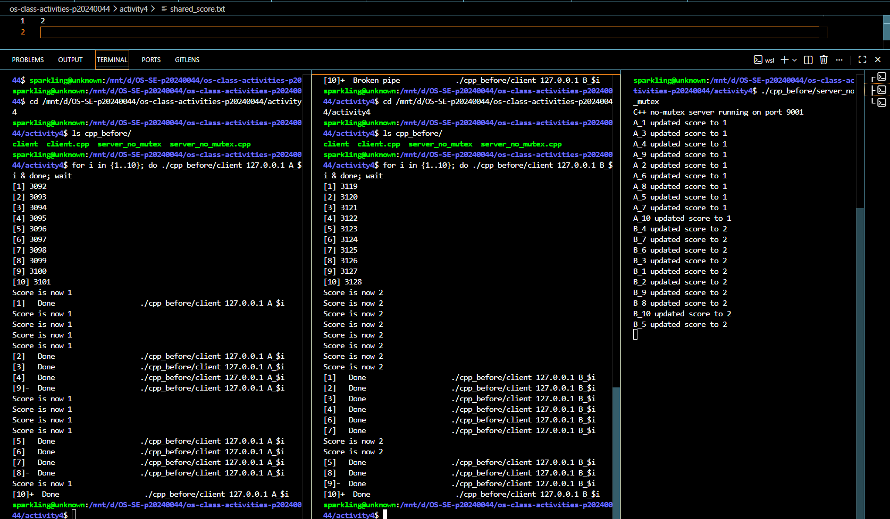
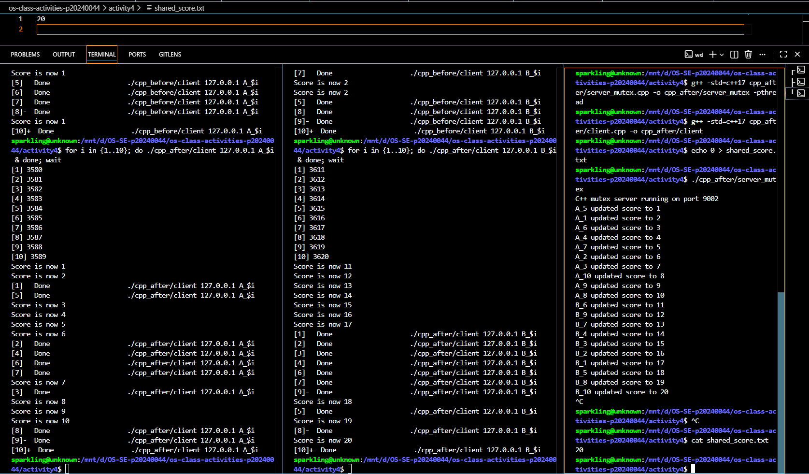
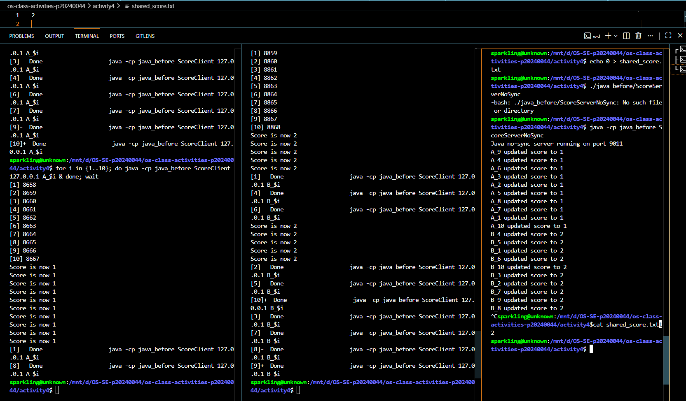
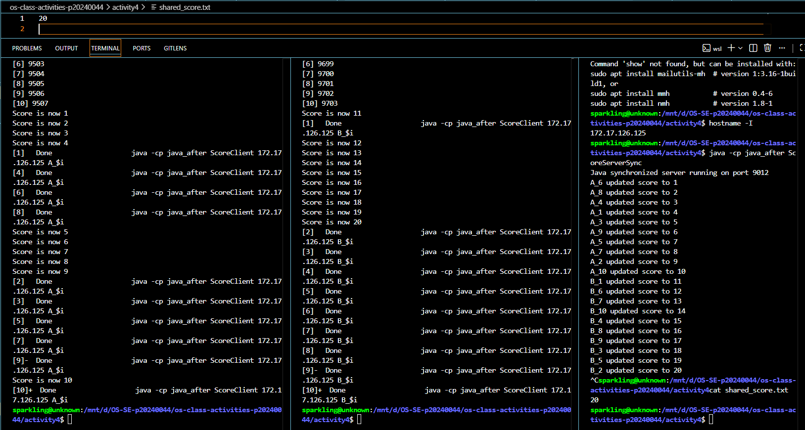

# Class Activity 4 — Shared File API

- **Student Name:** Chheng Sokuntehary
- **Student ID:** p20240044
- **Partner Name:** Chheng Sokuntheary
- **Partner Student ID:** p20240044
- **Server Machine Owner:** Chheng Sokuntheary
- **Server IP Address:** 172.17.126.125

---

## Task 1: C++ Before Mutex

- Expected score after 20 total client requests: 20
- Actual score: 2
- What happened: Multiple threads read the same value from the file at the same time before any of them could write back. All 10 of Student A's clients read 0 and wrote 1, then all 10 of Student B's clients read 1 and wrote 2. Updates were lost because there was no protection around the read-write operation.

---

## Task 2: C++ After Mutex

- Expected score after 20 total client requests: 20
- Actual score: 20
- What changed after adding mutex: The `std::lock_guard<std::mutex>` forces each thread to wait its turn before reading and writing the file. Only one thread can execute `update_score()` at a time, so no updates are lost.

---

## Task 3: Java Before Synchronized

- Expected score after 20 total client requests: 20
- Actual score: 2
- What happened: Multiple Java threads called `updateScore()` at the same time without any protection. Threads read the same score value before others could write back, causing lost updates and a final score lower than 20.

---

## Task 4: Java After Synchronized

- Expected score after 20 total client requests: 20
- Actual score: 20
- What changed after adding synchronized: The `synchronized` keyword on `updateScore()` ensures only one thread can execute it at a time. Each thread must acquire the lock before reading and writing the file, so all 20 updates are counted correctly.

---

## Questions

1. **Why should clients send requests to the server instead of writing the file directly?**  
   When many clients write to the same file directly, race conditions are very likely because there is no central control. By routing all requests through a server, only one program touches the file. This makes it easier to apply synchronization and ensures the file is updated in a controlled way.

2. **Why does the server still have a race condition before mutex or synchronized?**  
   The server creates one thread for each client connection. If multiple clients connect at the same time, multiple threads run `update_score()` simultaneously. Without a mutex or synchronized method, these threads can all read the same value, increment it, and write back the same result, causing lost updates.

3. **In the C++ fixed version, what does `std::lock_guard<std::mutex>` protect?**  
   It protects the entire `update_score()` function — specifically the sequence of reading the score from the file, incrementing it, and writing it back. Only one thread can execute this block at a time. When one thread holds the lock, all other threads must wait.

4. **In the Java fixed version, what does `synchronized` protect?**  
   It protects the entire `updateScore()` method. Java uses the class's intrinsic lock so that only one thread can execute `updateScore()` at a time. All other threads block until the current thread finishes and releases the lock.

5. **Why is the final score expected to be 20 when Student A sends 10 requests and Student B sends 10 requests?**  
   Each request increments the score by 1. Student A sends 10 requests and Student B sends 10 requests, so the total number of increments should be 10 + 10 = 20. If synchronization works correctly, no updates are lost and the final score is exactly 20.

6. **What could happen if two separate servers update the same file at the same time?**  
   Even if each server uses a mutex internally, the mutex is only shared between threads within the same process. Two separate server processes do not share a mutex, so they can still overwrite each other's changes. To fix this, you would need a file-level lock such as `flock` in Linux, or use a database that supports concurrent access safely.

---

## Reflection

Both C++ and Java solve the race condition by allowing only one thread to execute the critical section at a time. C++ uses `std::mutex` with `std::lock_guard`, which automatically releases the lock when it goes out of scope. Java uses the `synchronized` keyword directly on the method, which uses the object's intrinsic lock. Both approaches achieve the same result, but Java's syntax is simpler and built into the language, while C++ gives more explicit control over locking. This activity showed that even when a server acts as a single point of control for a shared file, synchronization is still necessary whenever multiple threads are involved.
