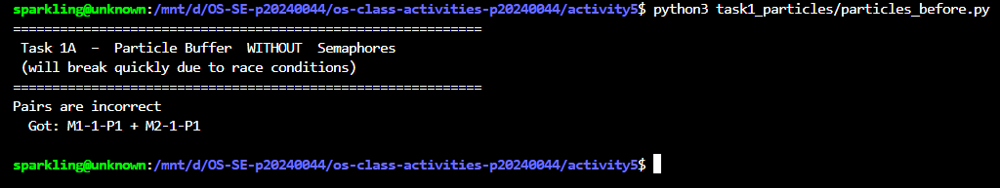
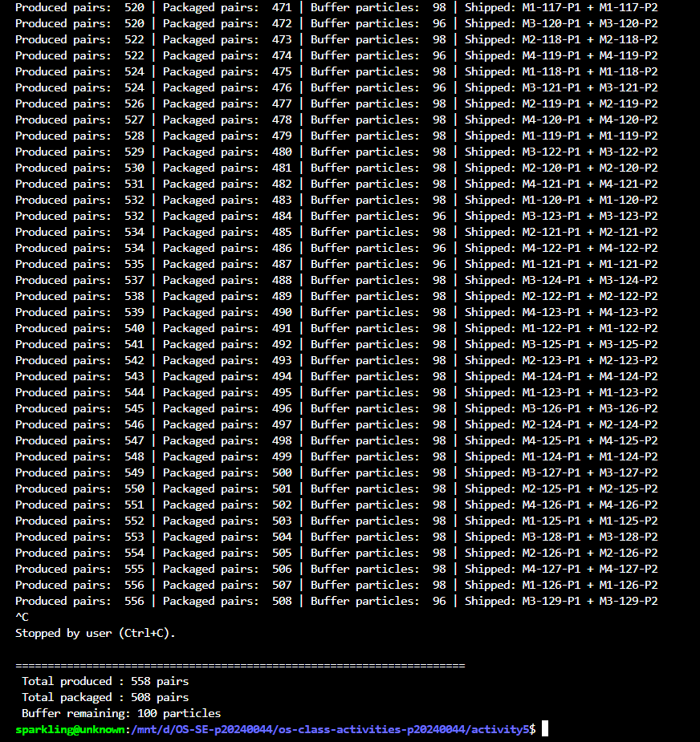
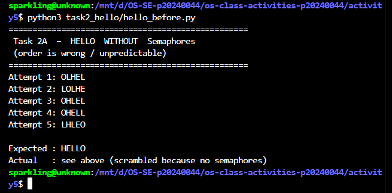
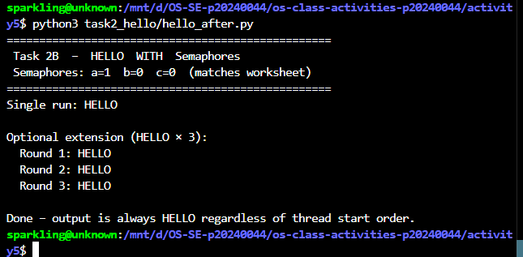

# Class Activity 5 - Semaphores

- **Student Name:** Chheng Sokuntheary
- **Student ID:** p20240044
- **Programming Language Used:** Python 3

---

## How to Run

No extra packages needed. Python 3 standard library only (`threading`, `time`, `random`).

Open a WSL terminal in VS Code and run from inside the `activity5/` folder:

```bash
# Task 1A — broken buffer, crashes with an error message
python3 task1_particles/particles_before.py

# Task 1B — correct buffer with semaphores, runs forever until Ctrl+C
python3 task1_particles/particles_after.py

# Task 2A — HELLO in wrong order (no semaphores)
python3 task2_hello/hello_before.py

# Task 2B — HELLO always correct (with semaphores)
python3 task2_hello/hello_after.py
```

---

## Task 1A: Particle Pair Buffer Before Semaphores



- **What error or incorrect behavior appeared:**
  The program immediately printed `Pairs are incorrect — Got: M1-1-P1 + M2-1-P1`. The consumer fetched two particles that came from different producer machines (Machine 1 and Machine 2), meaning P1 and P2 did not belong to the same pair.

- **Why this happened without semaphore protection:**
  There is no mutex protecting the buffer and no counting semaphore to gate access. Multiple producer threads run concurrently and each writes P1 then P2 with a small gap in between. During that gap, another producer's thread can insert its own particle into the buffer, breaking the consecutive-slot guarantee. The consumer then pops two unrelated particles. Without the `space` semaphore, there is also no protection against buffer overflow.

---

## Task 1B: Particle Pair Buffer After Semaphores



- **Number of producer machines:** 4
- **Buffer capacity:** 100 particles (50 pairs)
- **Semaphores used (names match the filled-in worksheet answer):**

  | Semaphore | Initial Value | Purpose |
  |-----------|---------------|---------|
  | `s`       | 0             | Counts complete pairs ready for the consumer to fetch |
  | `space`   | 50            | Counts free pair-slots; producers block when buffer is full |
  | `lock`    | 1             | Binary semaphore — mutual exclusion on the shared buffer |

- **Produced pair count shown in screenshot:** 558 pairs
- **Packaged pair count shown in screenshot:** 508 pairs
- **Buffer remaining when stopped:** 100 particles (50 pairs still in buffer)
- **Did any error appear during normal operation?** No. The program ran indefinitely and was stopped manually with Ctrl+C after confirming correct operation.

---

## Task 2A: HELLO Before Semaphores



- **Output before semaphore ordering:**

  | Attempt | Output |
  |---------|--------|
  | 1 | `OLHEL` |
  | 2 | `LOLHE` |
  | 3 | `OHLEL` |
  | 4 | `OHELL` |
  | 5 | `LHLEO` |

- **Why this output can be wrong or unpredictable:**
  All three threads are started at nearly the same time with no ordering constraint. The OS scheduler is free to run them in any order and can switch between them at any point. Process 3 (which prints `O`) and Process 2 (which prints `L`, `L`) have no mechanism forcing them to wait until Process 1 has printed `H` and `E` first. Every run produces a different scrambled result.

---

## Task 2B: HELLO After Semaphores



- **Processes or threads used:** 3 threads (Process 1, Process 2, Process 3)
- **Semaphores used (names and values match worksheet Problem 2B):**

  | Semaphore | Initial Value | Meaning |
  |-----------|---------------|---------|
  | `a`       | 1             | Allows Process 1 to start printing `H` immediately |
  | `b`       | 0             | Released by Process 1 after printing `HE`; gates Process 2's two `L`s |
  | `c`       | 0             | Released by Process 2 after printing `LL`; gates Process 3's `O` |

- **Final output:**
  ```
  Single run: HELLO

  Optional extension (HELLO × 3):
    Round 1: HELLO
    Round 2: HELLO
    Round 3: HELLO
  ```
- **Note:** Threads are deliberately started in reverse order (Process 3 first, Process 1 last) to prove that semaphores — not thread start order — control the output.

---

## Questions

**1. In Task 1, why does a producer need to wait before adding a pair to the buffer?**

A producer calls `wait(space)` before adding a pair. `space` is initialized to 50 (the maximum number of pair-slots). If the buffer already holds 50 pairs (100 particles), `space` equals 0 and the producer blocks until the consumer removes a pair and calls `signal(space)`. Without this wait, a producer would overflow the 100-particle buffer, triggering the "producing machine is broken" error.

**2. In Task 1, why does the consumer need to wait before removing a pair from the buffer?**

The consumer calls `wait(s)` before fetching. `s` is initialized to 0 and is incremented by `signal(s)` only after a producer has placed a complete pair. If the buffer is empty, `s` is 0 and the consumer blocks. Without this wait, the consumer could try to pop from an empty buffer, triggering the "packaging machine is broken" error.

**3. Which semaphore protects the critical section in your particle buffer program?**

`lock` (initialized to 1, used as a binary semaphore). It is acquired with `lock.acquire()` before any thread reads from or writes to the shared `buffer` list, and released with `lock.release()` immediately after. This ensures only one thread at a time can modify the buffer, preventing data corruption from concurrent access.

**4. How does your program verify that P1 and P2 belong to the same pair?**

Each particle is named in the format `M<machineID>-<pairID>-P1` or `M<machineID>-<pairID>-P2` — for example `M2-17-P1` and `M2-17-P2`. After the consumer pops two particles, it strips the `-P1` / `-P2` suffix using `rsplit("-", 1)[0]` and compares the base strings. If they differ (e.g., `"M1-1"` vs `"M2-1"` as seen in the Task 1A screenshot), the program prints `Pairs are incorrect` and stops immediately.

**5. In Task 2, why can the program print letters in the wrong order without semaphores?**

Without semaphores, all three threads start concurrently with no ordering constraint. The OS scheduler decides which thread executes first and can preempt any thread at any moment. As shown in the Task 2A screenshot, every one of the 5 attempts produced a different scrambled sequence (OLHEL, LOLHE, OHLEL, OHELL, LHLEO) because there is nothing preventing Process 2 or Process 3 from printing before Process 1 has finished.

**6. Which semaphore or synchronization step forces H to print before E, L, L, and O?**

Semaphore `a` (initial value 1) is acquired by Process 1 before printing anything. Since `a` starts at 1, only Process 1 can proceed immediately — no other process waits on `a`. After printing `H` and `E`, Process 1 calls `signal(b)`, which is the only way `b` can become 1 and unblock Process 2. Process 3 is similarly chained behind Process 2 via `c`. The enforced chain is: `wait(a)` → `H` → `E` → `signal(b)` → `wait(b)` → `L` → `L` → `signal(c)` → `wait(c)` → `O`.

**7. What could cause deadlock in either of your simulations?**

**Task 1:** Deadlock would occur if the semaphore acquisition order were reversed — for example, if a producer acquired `lock` first and then blocked on `space`, while the consumer held `lock` waiting to call `signal(space)`. Neither could ever proceed — a circular wait. The correct order (counting semaphore first, then `lock`) is what prevents this.

**Task 2:** Deadlock would occur if the signal chain formed a cycle — for example, if Process 2 waited on a semaphore that Process 3 was supposed to signal, while Process 3 waited on a semaphore that Process 2 was supposed to signal. Neither could proceed. The strictly linear one-directional chain (Process 1 → 2 → 3) eliminates any possibility of a cycle.

---

## Reflection

These simulations made race conditions and synchronization problems very tangible. In Task 1A, the tiny sleep inserted between appending `P1` and `P2` was enough to cause a pair mismatch immediately — matching exactly what happened in the screenshot (`M1-1-P1 + M2-1-P1`). The Task 1B fix required two different kinds of semaphore working together: `space` and `s` for resource counting (preventing overflow and underflow), and `lock` for mutual exclusion (preventing interleaved writes). Neither alone is sufficient.

Task 2 demonstrated that semaphores are not only for protecting shared data — they can enforce strict temporal ordering between independent threads. The fact that threads are started in reverse order in `hello_after.py` yet always print `HELLO` correctly shows that semaphores, not thread creation order, control execution sequencing.