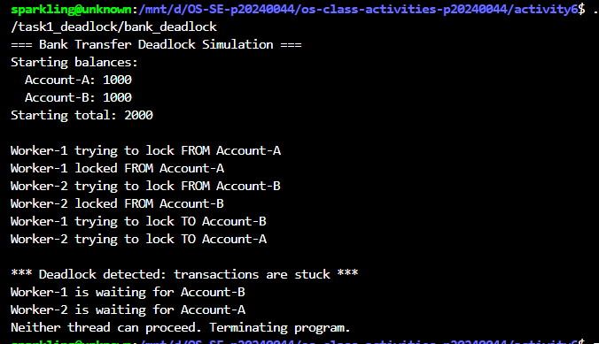
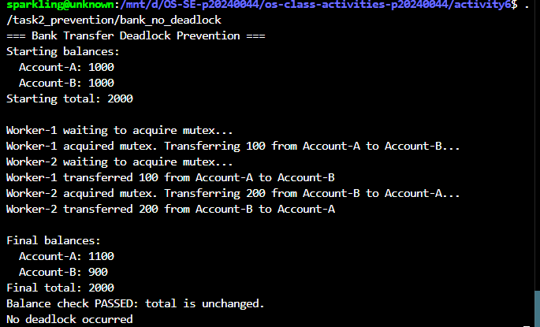

# Class Activity 6 - Deadlock Simulation

- **Student Name:** Chheng Sokuntheary
- **Student ID:** p20240044
- **Programming Language Used:** C++

---

## Task 1: Deadlock Version

- **Shared resources:** Account-A and Account-B (each protected by its own semaphore lock)
- **Transaction 1:** Transfer 100 from Account-A to Account-B
- **Transaction 2:** Transfer 200 from Account-B to Account-A
- **Deadlock message shown:** `*** Deadlock detected: transactions are stuck ***`
- **Explanation of why the program got stuck:**  
  Worker-1 locked Account-A first, then tried to lock Account-B.  
  Worker-2 locked Account-B first, then tried to lock Account-A.  
  After the 100ms sleep, both threads were each holding one lock and  
  blocking on the other — neither could proceed, creating a circular wait.  
  The watchdog detected no completed transfers after 3 seconds and  
  printed the deadlock message before terminating the program.

---

## Task 2: Deadlock Prevention Version

- **Prevention strategy used:** Single global semaphore mutex (initialized to 1) protecting the entire transfer operation
- **Semaphore mutex initial value:** 1
- **Starting total:** 2000
- **Final total:** 2000
- **Did both transfers complete?** Yes — Worker-1 transferred 100 from Account-A to Account-B; Worker-2 transferred 200 from Account-B to Account-A
- **Why no deadlock occurred:**  
  The single mutex ensures only one thread can perform a transfer at a time.  
  Worker-2 waited to acquire the mutex while Worker-1 completed its transfer first.  
  Since no thread ever holds one account lock while waiting for another,  
  circular wait is impossible and both transfers completed successfully.

---

## Questions

1. **What are the two shared resources in your bank transaction simulation?**  
   Account-A and Account-B. Both accounts are accessed and modified concurrently  
   by multiple threads, making them the shared resources at risk of deadlock.

2. **Which line or section of your Task 1 program creates hold-and-wait?**  
   The sequence `sem_wait(&from.lock)` followed by `sleep_for(100ms)` followed  
   by `sem_wait(&to.lock)`. Each thread acquires its source account lock and holds  
   it while sleeping, then blocks waiting to acquire the destination account lock.  
   This is exactly the hold-and-wait condition.

3. **How does Task 1 create circular wait?**  
   Worker-1 holds Account-A and waits for Account-B.  
   Worker-2 holds Account-B and waits for Account-A.  
   This forms a cycle: Worker-1 → Account-B → Worker-2 → Account-A → Worker-1,  
   which is the definition of circular wait — each thread waits for a resource  
   held by the other.

4. **Why does the Task 1 program need a watchdog or timeout?**  
   A deadlocked program hangs indefinitely with no further output. Without a  
   watchdog, the user cannot distinguish between a program that is slow and one  
   that is truly stuck. The watchdog detects that no transfer completed within  
   3 seconds and prints the required deadlock message, making the deadlock  
   clearly visible in the output instead of silently hanging forever.

5. **How does the single semaphore mutex prevent deadlock in Task 2?**  
   The mutex (initialized to 1) allows only one thread to enter the transfer  
   critical section at a time. A thread acquires the mutex, updates both account  
   balances atomically, then releases the mutex. Since only one thread operates  
   on the accounts at any moment, no thread ever holds one resource while waiting  
   for another — eliminating the hold-and-wait condition entirely.

6. **Which of the four deadlock conditions does your Task 2 solution remove or avoid?**  
   It removes **hold-and-wait**: a thread acquires the single mutex and completes  
   the full transfer before releasing it, so it never holds one lock while waiting  
   for another. It also eliminates **circular wait**: since only one thread is  
   active in the critical section at a time, no cycle of waiting threads can form.

7. **Why must the final total bank balance remain unchanged after both transfers?**  
   A transfer moves money between accounts — it does not create or destroy money.  
   The invariant total = Account-A + Account-B = 2000 must hold at all times.  
   If the total changed, it would indicate a race condition corrupted the data.  
   In our output, starting total = 2000 and final total = 2000, confirming  
   both transfers were atomic and correct.

---

## Reflection

This activity demonstrated how easily deadlock can emerge when multiple threads  
lock shared resources in different orders. In Task 1, the 100ms sleep made the  
circular wait almost certain to trigger on every run. In real banking or database  
systems, transactions regularly lock rows or records, and without careful design —  
such as consistent lock ordering, single mutexes, or deadlock detection timeouts —  
two concurrent operations can silently freeze the entire system indefinitely.  
The single semaphore fix in Task 2 is simple and guaranteed to prevent deadlock,  
but it sacrifices concurrency by serializing all transfers one at a time. A  
production system would use strategies like global lock ordering (always lock  
the lower-ID account first) to allow more parallelism while still preventing deadlock.
