# Class Activity 7 - Reasoning About Deadlock

- Student Name: Chheng Sokuntheary
- Student ID: p20240044
- My personalization: a = 4 (last digit), b = 4 (second-to-last digit)

---

## Task 1 -- Resource Allocation Graphs

### Part A

Graph 1 -- my prediction: Cycle exists. System is DEADLOCKED.
Cycle path: P0 -> R1 -> P1 -> R2 -> P2 -> R0 -> P0
Every process holds one resource and waits for the next,
forming a circular wait with no escape.

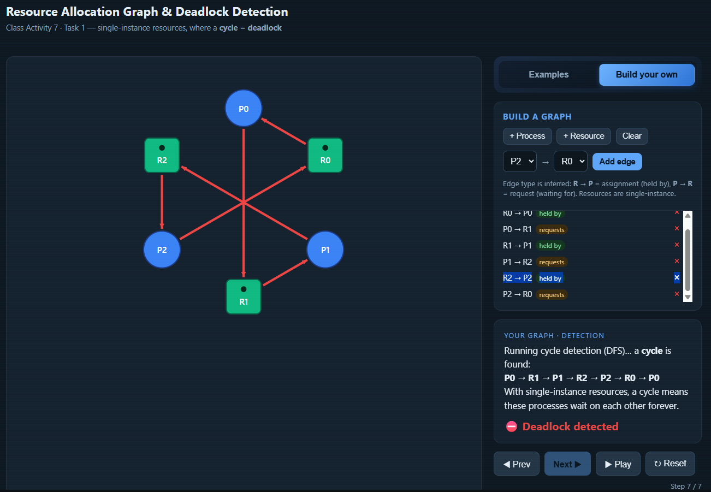

Matched the tool? YES -- tool found the same cycle and confirmed deadlock.

---

Graph 2 -- my prediction: No cycle. NOT deadlocked.
P2 holds R2 but requests nothing -> P2 finishes first,
releases R2 -> P1 unblocks -> P1 finishes, releases R1
-> P0 unblocks -> P0 finishes.
Finishing order: P2 -> P1 -> P0

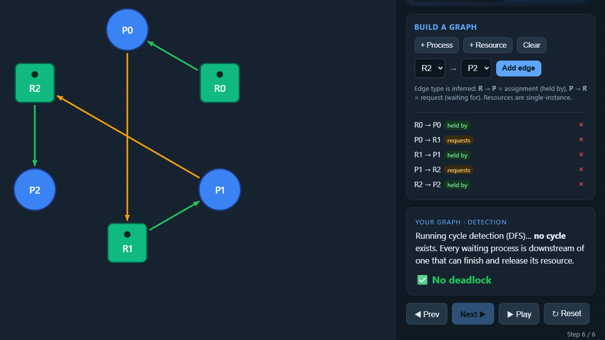

Matched the tool? YES -- no cycle found, no deadlock.

---

### Part B

(i) Deadlocked 3x3 graph -- edges used:
    R0->P0, P0->R1, R1->P1, P1->R2, R2->P2, P2->R0

    Why it deadlocks: every process holds one resource and waits
    for the next in a circle -- circular wait with no escape route.
    The cycle passes through all three processes: P0->R1->P1->R2->P2->R0->P0.

    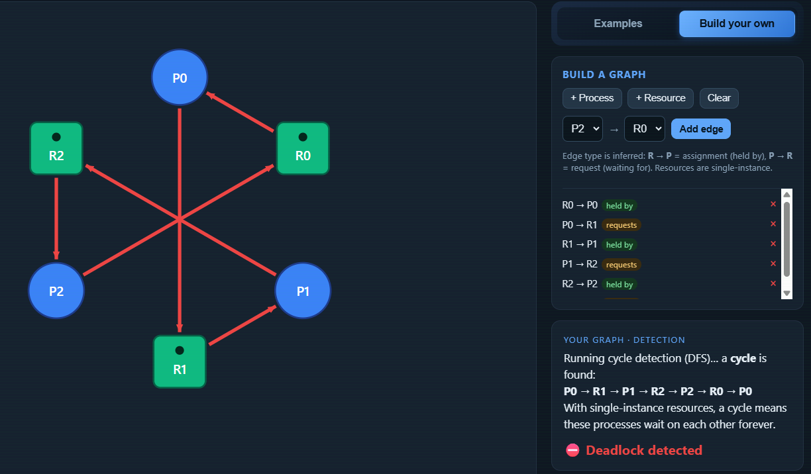

---

(ii) No-cycle graph (4 nodes, at least 1 request edge) -- edges used:
     R0->P0, P0->R1, R1->P1

     Why deadlock-free: P1 holds R1 but requests nothing, so P1
     finishes first and releases R1 -> P0 unblocks and finishes.
     At least one process is waiting (P0->R1) yet no circular wait
     can form because P1 is not waiting for anyone.

     

---

## Task 2 -- Cycle is Not Always a Deadlock

### Warm-up (built-in examples)

1. Why the "Cycle, NO deadlock" example is not deadlocked:
   There is a spare (extra) instance of one resource that no
   process currently holds. That free unit satisfies one process's
   request even while the cycle exists. That process finishes,
   releases all its held resources, and those releases unblock the
   other processes in the cycle one by one. The cycle dissolves --
   so no deadlock.

2. The single change that causes deadlock in "Cycle, deadlock":
   The spare instance is removed (or an extra request consumes the
   last free unit). Now Available = 0 for the critical resource.
   Every process is waiting and none can satisfy Request <= Work.
   The cycle has no escape route -- it becomes a true deadlock.

---

### Part A -- given scenario

1. Available = Total - Sigma(Allocation):
   R1: 2 - (1+0+1) = 0
   R2: 1 - (0+1+0) = 0
   R3: 2 - (0+1+1) = 0
   Available = [0, 0, 0]

2. The cycle (as a path): P1 -> R2 -> P2 -> R1 -> P1

   Process in the cycle that can still finish: P3
   Why: P3's Request = [0,0,0] -- it is not waiting for anything,
   so it can proceed immediately even though Available = [0,0,0].

3. Reduction by hand:

   Work starts = [0, 0, 0]

   Step | Process chosen | Why Request <= Work          | Work after it releases
   -----|----------------|------------------------------|------------------------
   1    | P3             | [0,0,0] <= [0,0,0] YES       | [0,0,0]+[1,0,1] = [1,0,1]
   2    | P2             | [1,0,0] <= [1,0,1] YES       | [1,0,1]+[0,1,1] = [1,1,2]
   3    | P1             | [0,1,0] <= [1,1,2] YES       | [1,1,2]+[1,0,0] = [2,1,2]

   Conclusion: NOT deadlocked. Finishing order = P3 -> P2 -> P1

4. Verify:
   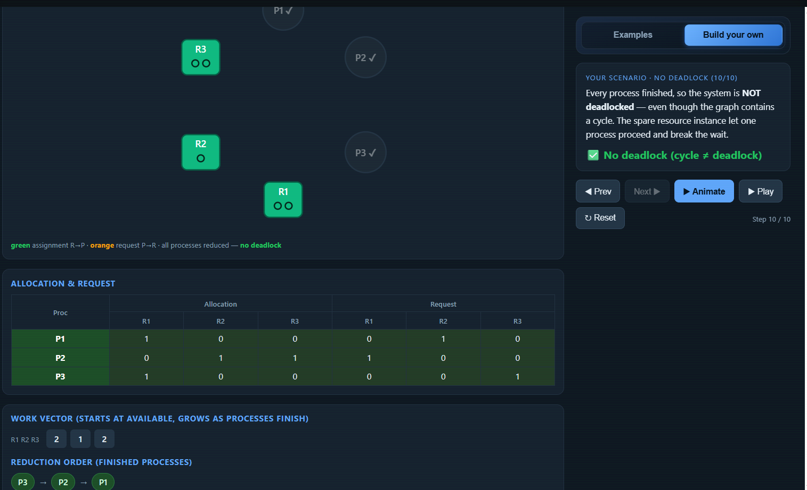
   Tool matched my hand trace. YES

5. One change -> deadlock:
   Change P3 Request from [0,0,0] to [0,1,0].

   Prediction: DEADLOCKED.
   - Previously P3 started the reduction because Request [0,0,0] <= Work [0,0,0].
   - Now P3 needs R2=1 but Work R2=0. P3 is blocked.
   - P1 needs R2=1, Work R2=0. P1 is blocked.
   - P2 needs R1=1, Work R1=0. P2 is blocked.
   - No process can satisfy Request <= Work. System is deadlocked.

   
   Tool confirmed: Deadlock detected. YES

---

### Part B -- my own scenario

Scenario: 2 processes, 2 resources (R1=2 instances, R2=1 instance)

           Allocation         Request
           R1    R2           R1    R2
   P1       1     0            0     1
   P2       0     1            1     0

Available = [2-(1+0), 1-(0+1)] = [1, 0]

Cycle exists: P1->R2->P2->R1->P1

Reduction:
   Work=[1,0]: P2 Request[1,0] <= [1,0] YES -> P2 finishes -> Work=[1,1]
               P1 Request[0,1] <= [1,1] YES -> P1 finishes
   NOT deadlocked -- spare R1 instance lets P2 go first.

One change: R1 instances 2->1
Now Available R1 = 1-1 = 0. Neither P1 nor P2 can satisfy
Request <= Work. DEADLOCKED.

In reduction terms: P2 previously started the reduction because
its Request R1=1 <= Work R1=1 (the spare instance). After reducing
instances to 1, Available R1=0, so P2 Request[1,0] can no longer
satisfy <= Work[0,0]. No process can proceed -- deadlock.

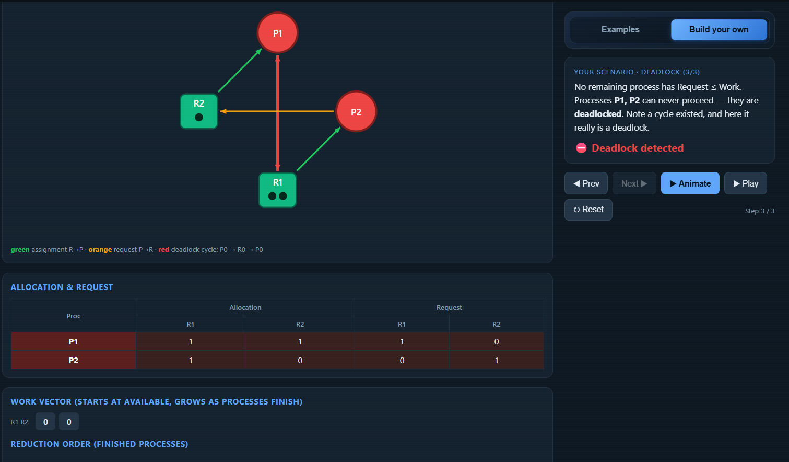

---

## Task 3 -- Banker's Algorithm (my personalized scenario)

My personalization:
   a = 4 (last digit of p20240044)
   b = 4 (second-to-last digit of p20240044)

   Max[P0][A] = 7 + (4 mod 3) = 7 + 1 = 8
   Max[P2][C] = 2 + (4 mod 4) = 2 + 0 = 2

Full scenario (Total: A=10, B=5, C=7):

           Allocation              Max
           A     B     C           A     B     C
   P0      0     1     0           8     5     3
   P1      2     0     0           3     2     2
   P2      3     0     2           9     0     2

Need matrix (Max - Allocation):

           Need
           A     B     C
   P0      8     4     3
   P1      1     2     2
   P2      6     0     0

Available:
   A: 10 - (0+2+3) = 5
   B:  5 - (1+0+0) = 4
   C:  7 - (0+0+2) = 5
   Available = [5, 4, 5]

Safety trace (by hand):

Work starts = [5, 4, 5]

Step | Process chosen | Why Need <= Work          | Work after it releases
-----|----------------|---------------------------|-------------------------
1    | P1             | [1,2,2] <= [5,4,5] YES    | [5,4,5]+[2,0,0] = [7,4,5]
2    | P2             | [6,0,0] <= [7,4,5] YES    | [7,4,5]+[3,0,2] = [10,4,7]
3    | P0             | [8,4,3] <= [10,4,7] YES   | [10,4,7]+[0,1,0] = [10,5,7]

Conclusion: SAFE -- safe sequence = P1 -> P2 -> P0

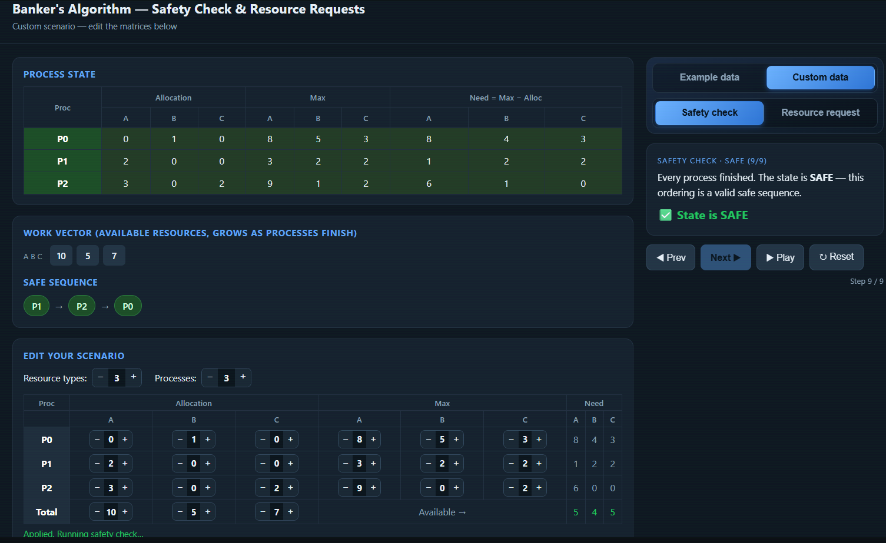

Matched the tool? YES. Note: a safe sequence is not unique --
if the tool shows a different order but all processes finish,
both sequences are correct.

---

Request I predicted GRANTED: P1 requests [A=1, B=0, C=0]

   Check 1: Request [1,0,0] <= Need [1,2,2]?
            1<=1 YES  0<=2 YES  0<=2 YES  --> PASS
   Check 2: Request [1,0,0] <= Available [5,4,5]?
            1<=5 YES  0<=4 YES  0<=5 YES  --> PASS
   Check 3: Tentative Available = [5-1, 4-0, 5-0] = [4,4,5]
            Run safety check --> safe sequence still exists --> PASS

   Verdict: GRANTED

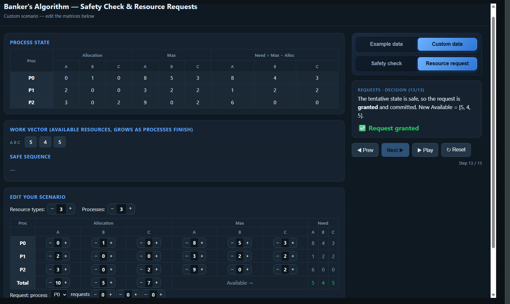

---

Request I predicted DENIED: P0 requests [A=5, B=4, C=3]

   Check 1: Request [5,4,3] <= Need [8,4,3]?
            5<=8 YES  4<=4 YES  3<=3 YES  --> PASS
   Check 2: Request [5,4,3] <= Available [5,4,5]?
            5<=5 YES  4<=4 YES  3<=5 YES  --> PASS
   Check 3: Tentative Available = [5-5, 4-4, 5-3] = [0,0,2]
            P0 Need[8,4,3] <= [0,0,2]? NO
            P1 Need[1,2,2] <= [0,0,2]? NO
            P2 Need[6,0,0] <= [0,0,2]? NO
            No process can proceed --> UNSAFE --> FAIL

   Verdict: DENIED -- check 3 failed, tentative state is unsafe.

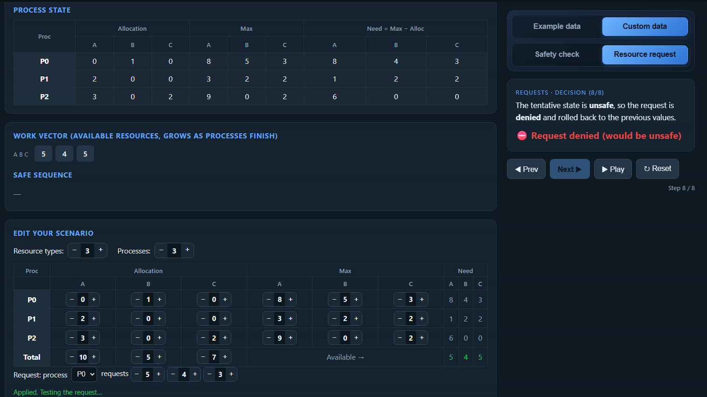

---

## Task 4 -- Semaphores and Deadlock

Case 1 (s1=s2=s3=1) -- my answer: YES, can deadlock

   Worst-case interleaving:
      P1 runs wait(s1) --> holds s1, now wants s2
      P2 runs wait(s2) --> holds s2, now wants s3
      P3 runs wait(s1) --> BLOCKED (s1 taken by P1)
      ... dangerous snapshot:
      P1 holds s1, wants s2
      P2 holds s2, wants s3
      P3 holds s3, wants s1

   Wait-for cycle: P1->s2->P2->s3->P3->s1->P1

   Every process holds one semaphore and waits for the next
   in a circle -- circular wait with no escape.

   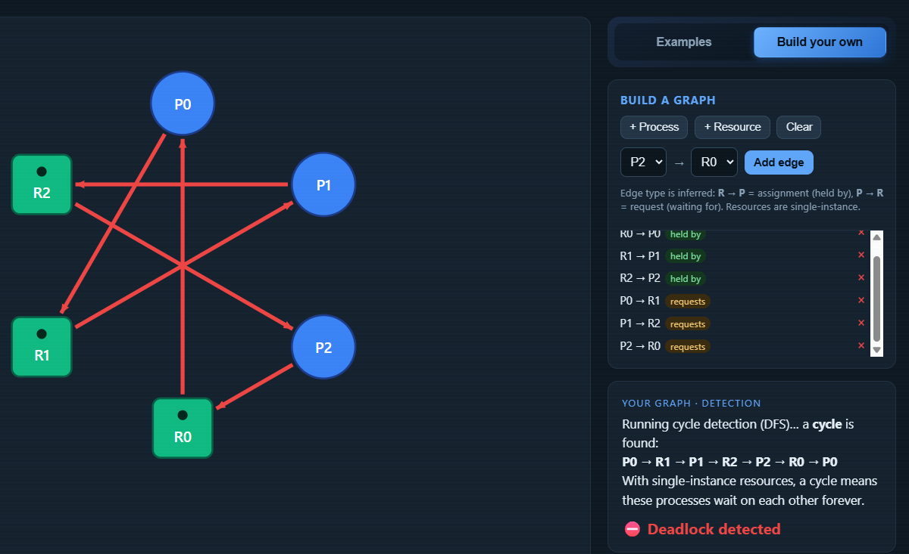
   Tool confirmed? YES -- deadlock detected.

---

Case 2 (s1=s2=s3=1) -- my answer: YES, can deadlock

   P3 now acquires in order: wait(s2) -> wait(s3) -> wait(s1)

   Worst-case interleaving:
      P1 runs wait(s1) --> holds s1, wants s2
      P3 runs wait(s2) --> holds s2, wants s3 then s1

   Wait-for cycle: P1->s2->P3->s1->P1

   P1 holds s1 and wants s2 (held by P3).
   P3 holds s2 and eventually wants s1 (held by P1).
   Circular wait forms between P1 and P3 -- deadlock.

   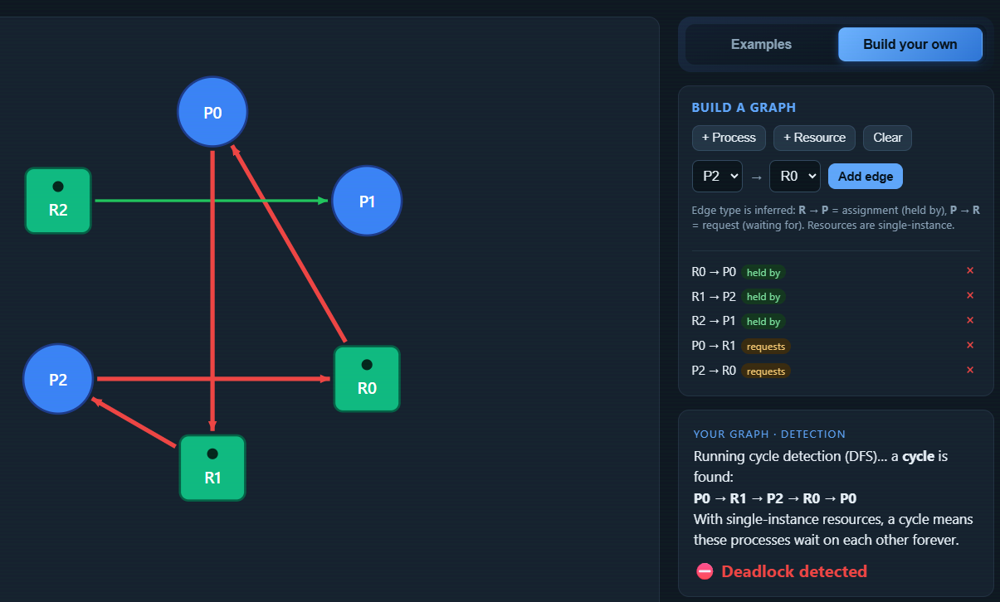
   Tool confirmed? YES -- deadlock detected.

---

Case 3 (s1=2, s2=1, s3=1) -- my answer: NO, cannot deadlock

   Same code as Case 2 but s1 has 2 instances.

   The extra instance of s1 means P3 can acquire the second
   instance of s1 without waiting for P1 to release it first.
   P3 proceeds, finishes, and releases s2 -- the circular wait
   is broken before it can form.

   Reduction order from tool: P3 -> P1 -> P2
   Available = [1, 0, 0] (spare s1 instance)
   P3 Request[1,0,0] <= Work[1,0,0] YES -> P3 finishes
   -> Work grows -> P1 and P2 unblock one by one.

   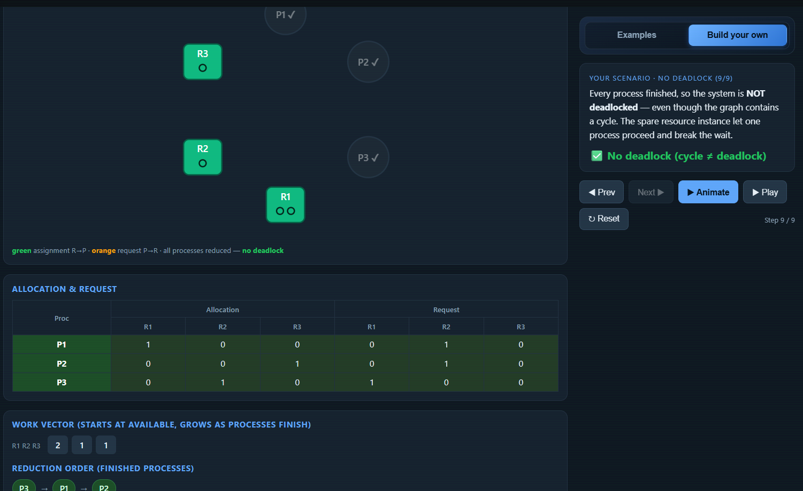
   Tool confirmed? YES -- no deadlock (cycle does not equal deadlock).

---

## Task 5 -- Applied Concepts

1. Four necessary conditions for deadlock, mapped to a kitchen scenario:

   (a) Mutual Exclusion:
       Only one chef can use the oven at a time.
       The oven cannot be shared simultaneously.

   (b) Hold and Wait:
       Chef A holds the oven and waits for the knife
       that Chef B is currently holding.

   (c) No Preemption:
       Nobody can force Chef A to give up the oven --
       Chef A must finish and release it voluntarily.

   (d) Circular Wait:
       Chef A waits for the knife (held by Chef B),
       Chef B waits for the oven (held by Chef A).

   Easiest condition to remove: Hold and Wait.
   Solution: force each chef to request ALL tools at once before
   starting. If any tool is unavailable, the chef requests nothing
   and waits until the full set is free.
   Cost: tools sit idle even when not needed yet, leading to
   poor utilization and longer wait times overall.

---

2. Single-instance vs multi-instance cycle:

   In a single-instance RAG, each resource has exactly one unit --
   if a cycle exists, every process in it is permanently blocked
   with no way out, so cycle = deadlock.

   In a multi-instance system, a spare instance of a resource may
   let one process proceed and finish, releasing its held resources
   and breaking the cycle -- so a cycle is necessary but not
   sufficient for deadlock.

---

3. Unsafe state vs deadlocked state:

   A deadlocked state means processes are ALREADY stuck and cannot
   proceed -- no process can make progress.

   An unsafe state means the OS cannot GUARANTEE everyone will
   finish -- deadlock might happen depending on future requests,
   but has not happened yet.

   Example of unsafe but not deadlocked:
   Available=[0,0,0] but one process has Need=[0,0,0] and can
   still finish. That process proceeds, but after it releases
   resources, the remaining processes may still deadlock depending
   on future requests -- unsafe, yet not currently deadlocked.

---

4. Deadlock avoidance (Banker's) vs detection + recovery:

   Banker's Algorithm (Avoidance):
   - Cost: every process must declare its maximum resource demand
     in advance, which is impractical for many real programs that
     do not know their needs ahead of time.
   - Best for: embedded systems or real-time systems where resource
     needs are fixed and known (e.g. factory machine controllers).

   Detection + Recovery:
   - Cost: deadlock may already be hurting system performance
     before it is detected; recovery (killing processes or rolling
     back transactions) is disruptive and may cause lost work.
   - Best for: database systems where transactions can be safely
     rolled back and retried without lasting harm.

---

5. Why Banker's Algorithm requires maximum demand in advance:

   The algorithm needs maximum demand so it can simulate the
   worst-case future requests for every process and check whether
   a safe sequence still exists after granting a request. Without
   knowing the maximum, the OS cannot determine whether the current
   state is safe or might lead to deadlock.

   Real-world problem: most processes do not know exactly how many
   resources they will need before they begin running. Programmers
   often declare an overestimate to be safe, which causes the OS
   to withhold resources unnecessarily -- leading to poor
   utilization and denied requests even when deadlock was never
   a realistic risk.

---

## Reflection

This activity taught me that a cycle in a multi-instance system
does not always mean deadlock -- a spare resource instance can
let one process finish and break the cycle. The key insight is
that the reduction algorithm (checking Request <= Work step by
step) is what truly determines whether deadlock exists, not just
the visual presence of a cycle in the graph.

For real systems like databases, detection + recovery is more
practical because processes cannot always declare their maximum
demand in advance. But for safety-critical systems with
predictable workloads, Banker's Algorithm provides stronger
guarantees at the cost of flexibility and utilization.