# OS Lab 1 — Introduction to Operating Systems (Hands-on)

- **Student Name:** Chheng Sokuntheary
- **Student ID:** p20240044

---

## Task 1: Operating System Identification

I used `uname -a` and `lsb_release -a` to identify the kernel version and Linux 
distribution running on my system. The output showed I am running Ubuntu on WSL 
with the Linux kernel version.

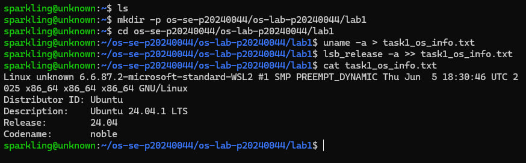
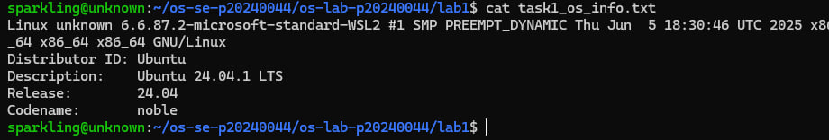

---

## Task 2: Essential Linux File and Directory Commands

I practiced creating directories and files using `mkdir` and `touch`, writing 
content with `echo`, viewing files with `cat`, copying with `cp`, renaming with 
`mv`, and deleting with `rm`.

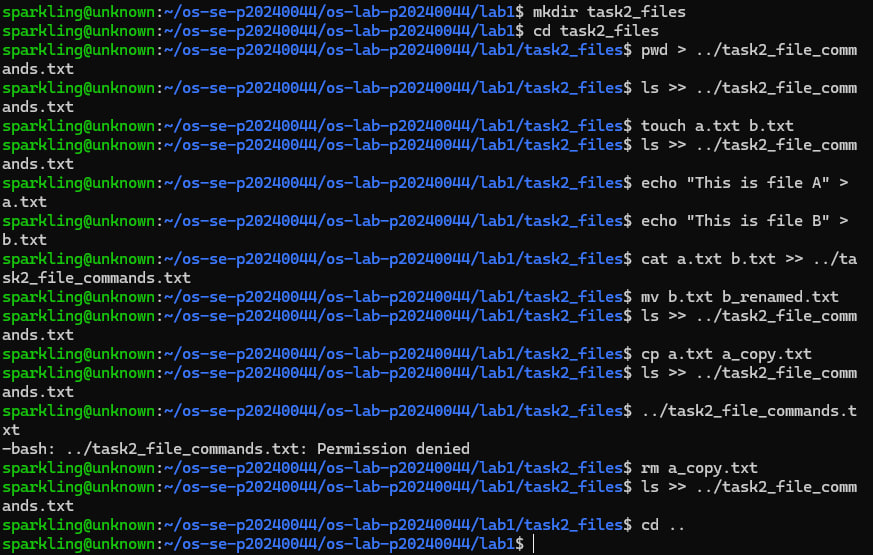
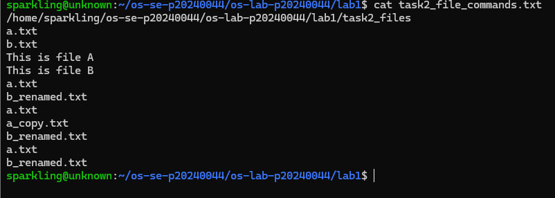

---

## Task 3: Package Management Using APT

I installed `mc` (Midnight Commander) using `apt-get install`, then observed the 
difference between `remove` and `purge`. After `remove`, the `/etc/mc` config 
folder still existed. After `purge`, the folder was completely deleted, showing 
that `purge` removes both the program and its configuration files.

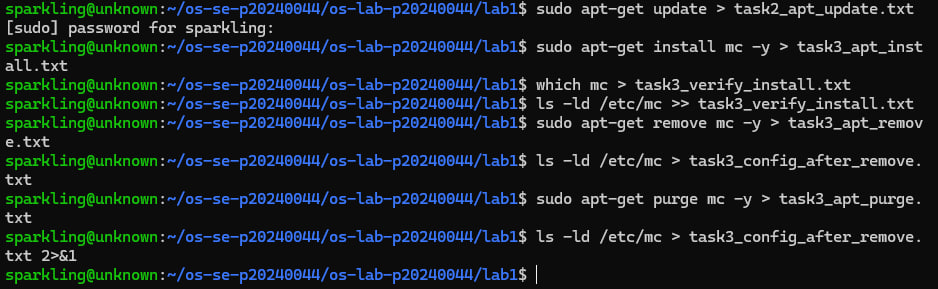
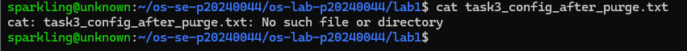

---

## Task 4: Programs vs Processes (Single Process)

I ran `sleep 120 &` to start a background process, then used `ps` to confirm it 
was listed as a running process. This shows that a program becomes a process once 
it is executed by the OS.

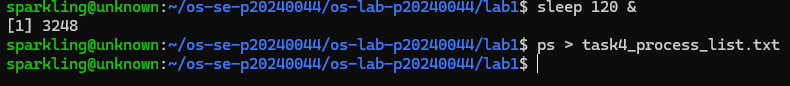
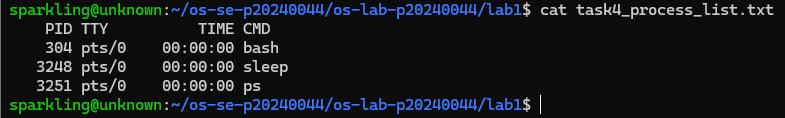

---

## Task 5: Installing Real Applications & Observing Multitasking

I installed `htop` and `tmux`, then launched multiple background processes 
(`sleep 500`, `sleep 600`, and a Python HTTP server on port 8080). Using `ps`, 
I could see all processes running simultaneously, demonstrating OS multitasking.

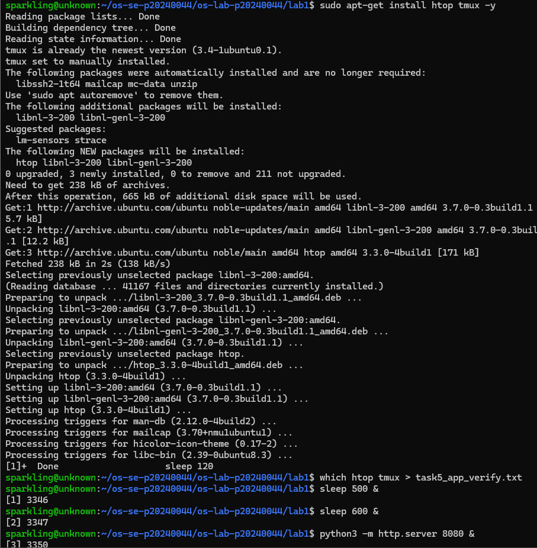
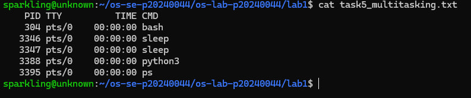
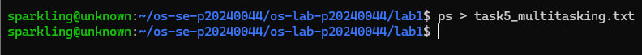

---

## Task 6: Virtualization and Hypervisor Detection

I used `systemd-detect-virt` and `lscpu` to check if my system is running on a 
virtual machine. The output confirmed that my system is running inside a 
virtualized environment (WSL is a form of virtualization on Windows).

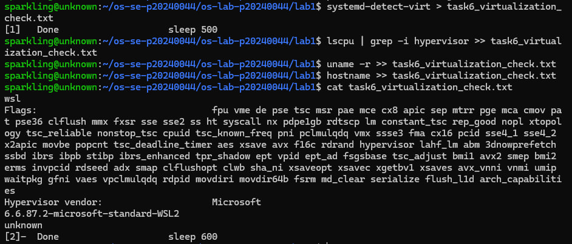