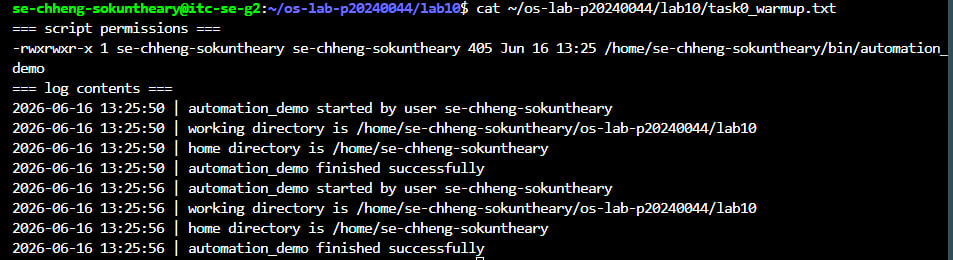
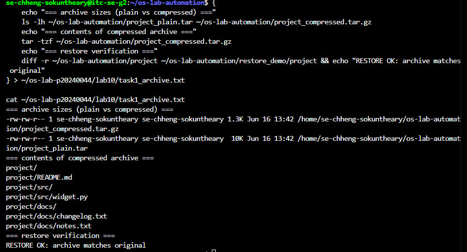
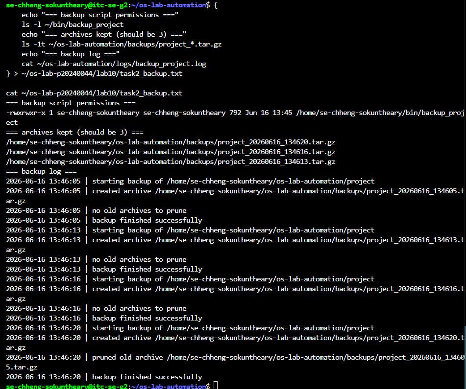
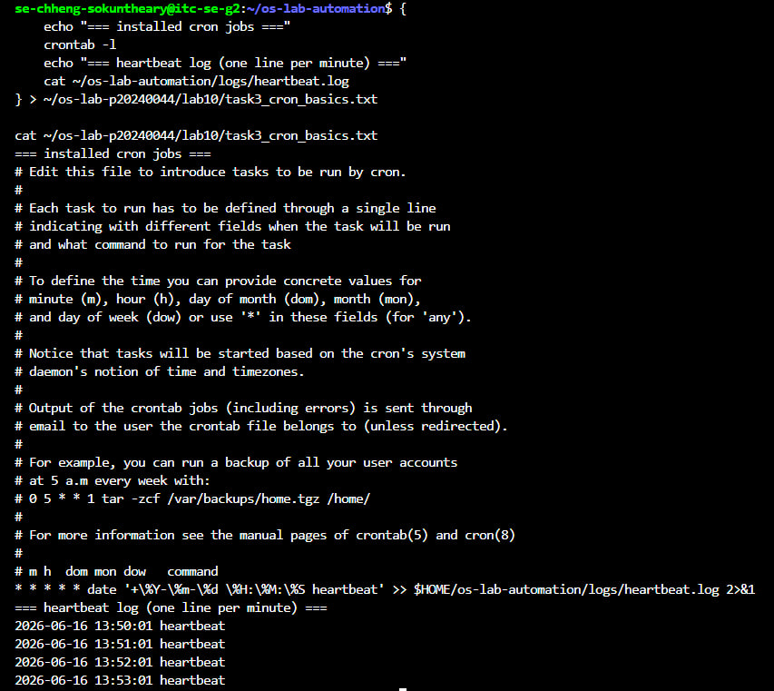
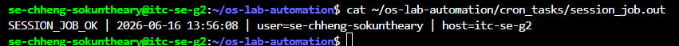
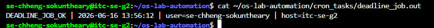
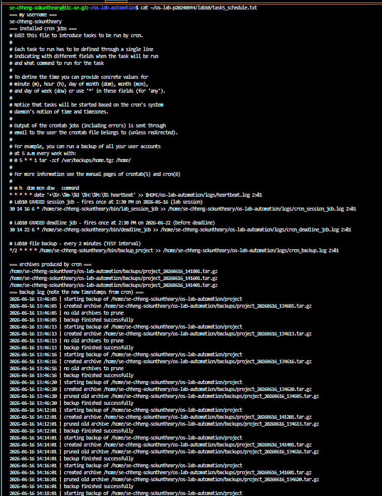
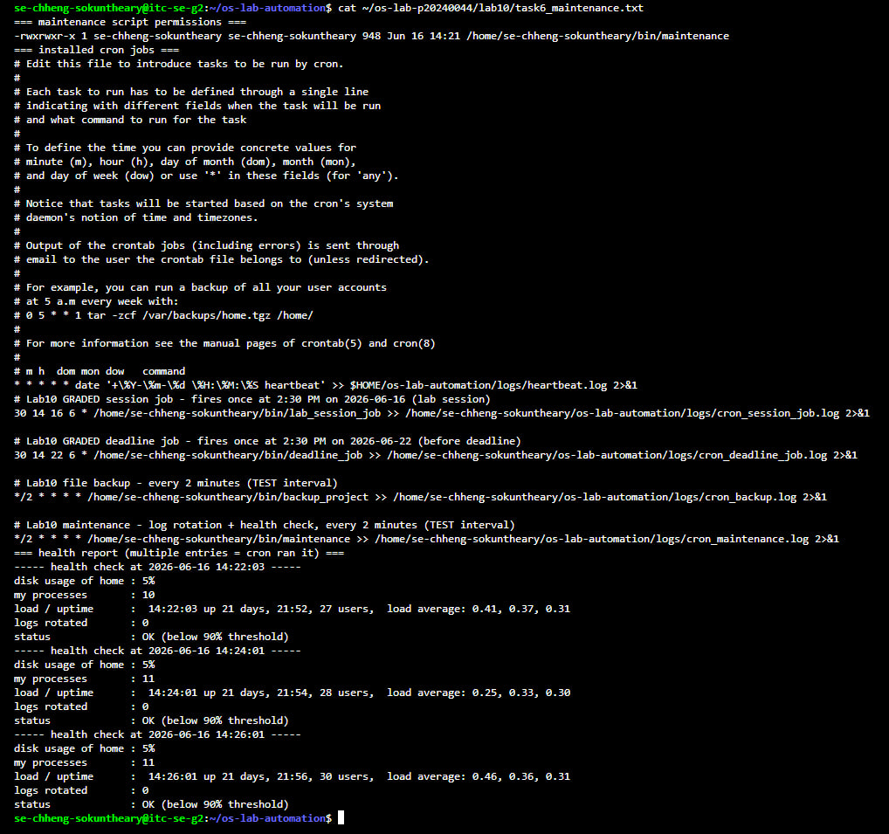
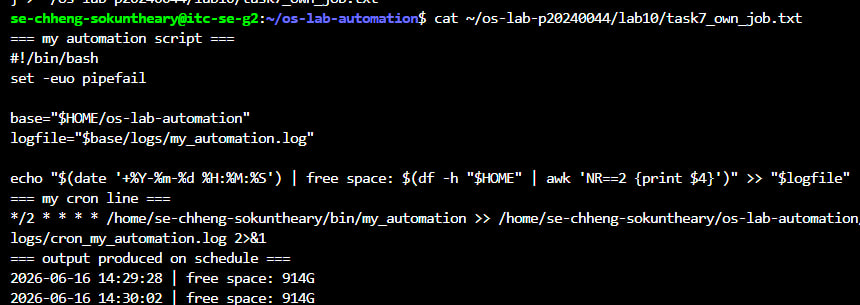
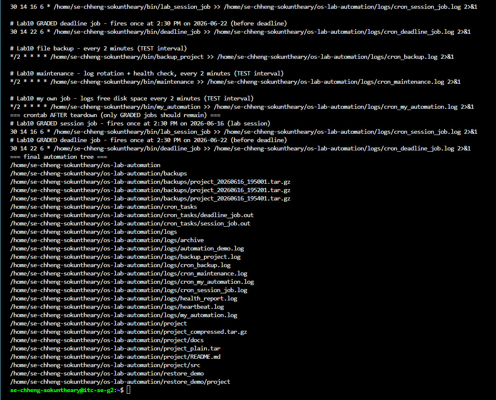

# OS Lab 10 - Backups, Archiving, Scheduling & cron Automation

| | |
|---|---|
| **Student Name** | Chheng Sokuntheary |
| **Student ID** | p20240044 |
| **Linux Username** | se-chheng-sokuntheary |
| **Date** | 2026-06-16 |

---

## Level 0 - Automation Warm-Up

**What I did:** Created automation_demo script using functions, timestamped logging with tee -a, and a clean exit 0. Ran it twice to confirm the log appends without overwriting previous entries.

---

## Level 1 - Archiving & Compression

**Size of .tar vs .tar.gz and why:**
The plain .tar was 10K and the compressed .tar.gz was 1.3K — about 8x smaller. The text files contain sequential numbers which compress extremely well with gzip. tar only bundles files together without shrinking them; gzip actually reduces the byte size.

---

## Level 2 - File & Folder Backup Script

**How my retention keeps only the 3 newest archives:**
The script uses ls -1t to list archives newest-first, then tail -n +4 to get everything after the 3rd entry. Those older files are deleted with rm -f and logged. On the 4th run, the oldest archive was pruned automatically.

---

## Level 3 - Cron Fundamentals

**My heartbeat cron line and what each field means:**

* * * * * date '+\%Y-\%m-\%d \%H:\%M:\%S heartbeat' >> $HOME/os-lab-automation/logs/heartbeat.log 2>&1

- Field 1 * — every minute
- Field 2 * — every hour
- Field 3 * — every day of month
- Field 4 * — every month
- Field 5 * — every day of week

---

## Level 4 - Timed Graded Cron Tasks

**The two graded schedules I installed:**

| Job | Schedule | Fires at |
|-----|----------|----------|
| Session job | 30 14 16 6 * | 2:30 PM 2026-06-16 |
| Deadline job | 30 14 22 6 * | 2:30 PM 2026-06-22 |

**Session job fired during the lab (SESSION_JOB_OK line in session_job.out):**

**Deadline job fired before the deadline (DEADLINE_JOB_OK line in deadline_job.out):**

---

## Level 5 - Scheduling the Backup

**Why the job needed the absolute path and output redirect:**
Cron runs with a minimal environment and does not load ~/.bashrc or ~/.profile, so ~/bin is not in its PATH. Using a bare name like backup_project would fail silently. The absolute path /home/se-chheng-sokuntheary/bin/backup_project guarantees cron can find the script. >> logfile 2>&1 captures both stdout and stderr so we can debug if something goes wrong.

---

## Level 6 - Maintenance Automation

**What my maintenance job rotates and reports:**
The script moves any .log files older than 1 day into logs/archive/. It then writes a health snapshot including disk usage percentage, number of running processes, system uptime, and an alert if disk usage reaches 90%.

---

## Level 7 - Design Your Own Scheduled Job

**What my script does:** Logs the free disk space of the home directory with a timestamp to my_automation.log.

**Schedule I chose (and why):** Every 2 minutes (*/2 * * * *) so it fires quickly during the lab session to prove it works on a schedule.

**What each of the five cron fields means in my line:**
- Field 1 */2 — every 2 minutes
- Field 2 * — every hour
- Field 3 * — every day of month
- Field 4 * — every month
- Field 5 * — every day of week

---

## Level 8 - Teardown and Reset

**How I removed the practice jobs while keeping the graded deadline job:**
Used crontab -l | grep -E 'GRADED|lab_session_job|deadline_job' | crontab - to keep only the two graded job blocks and pipe them back as the new crontab. Did NOT use crontab -r because that would have deleted the deadline job which still needs to fire on 2026-06-22.

---

## Lab Questions

1. **Archiving (tar) vs compression (gzip) — which shrinks bytes?**
tar combines many files into one archive without changing their size. gzip actually compresses and shrinks the bytes. Only gzip shrinks bytes.

2. **How much smaller was your .tar.gz than your .tar, and why?**
The .tar was 10K and the .tar.gz was 1.3K — about 8x smaller. The sequential number text files compress extremely well because of repetitive patterns.

3. **Why did your cron jobs need an absolute path instead of ~/bin/...?**
Cron runs with a minimal PATH that does not include ~/bin. It also does not expand ~ reliably. Absolute paths like /home/se-chheng-sokuntheary/bin/backup_project are always found regardless of the environment.

4. **Why must % be escaped as \% in a crontab, and what does >> logfile 2>&1 do?**
In crontab, % is a special character that means newline and would break the command. Escaping it as \% makes it literal. >> logfile appends stdout to the log file and 2>&1 redirects stderr to the same place, so all output is captured.

5. **How does your backup_project retention decide what to delete, and why keep only N backups?**
It lists archives newest-first with ls -1t, then uses tail -n +4 to get everything after the 3rd entry. Those are deleted. Keeping only N backups prevents the disk from filling up over time.

6. **Write the cron line that runs /home/me/bin/deadline_job once at 2:30 PM on 22 June. Which fields are filled in, which stay *?**
30 14 22 6 * /home/me/bin/deadline_job >> /home/me/os-lab-automation/logs/cron_deadline_job.log 2>&1
Fields filled: minute=30, hour=14, day=22, month=6. Day-of-week stays *.

7. **In Level 8 teardown, why a filtered crontab - pipeline instead of crontab -r? What would crontab -r have broken?**
crontab -r removes ALL cron jobs including the deadline job that still needs to fire on 2026-06-22. The filtered pipeline keeps only the graded jobs and removes the practice ones selectively.

8. **Why is a scheduled health check with a threshold alert useful in real software engineering / operations?**
It catches problems like full disks before they cause outages. An automated alert at 90% gives the team time to respond before the system stops working. Manual checks are unreliable and often missed.

9. **Describe the job you wrote in Level 7: what it does, the schedule, and the meaning of each of its five cron fields.**
My my_automation script logs the free disk space of the home directory with a timestamp to my_automation.log. Schedule: */2 * * * * — field 1 */2 every 2 minutes, field 2 * every hour, field 3 * every day of month, field 4 * every month, field 5 * every day of week.

