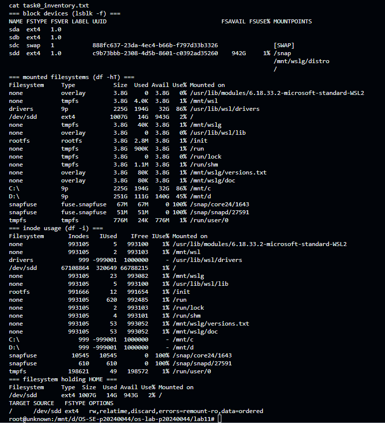
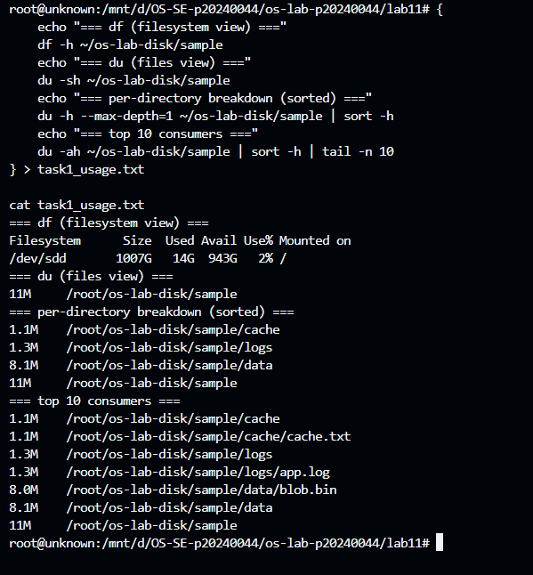
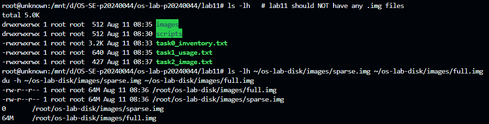
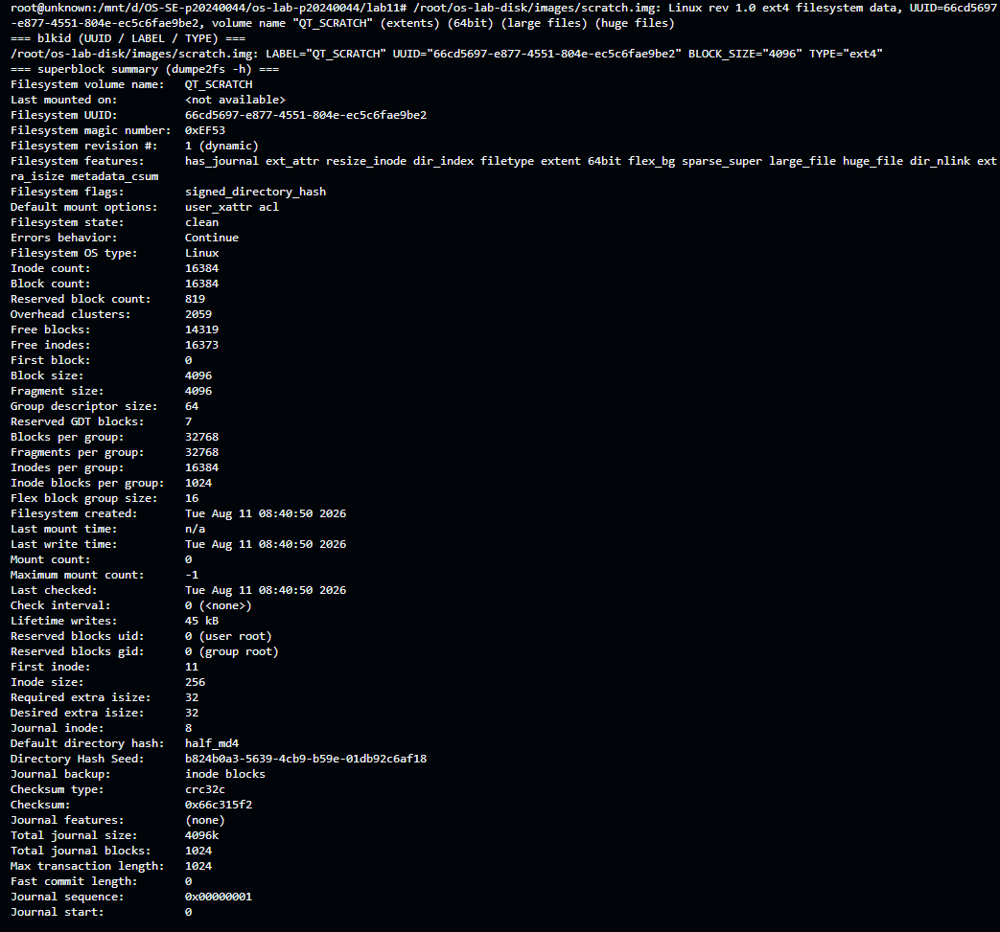
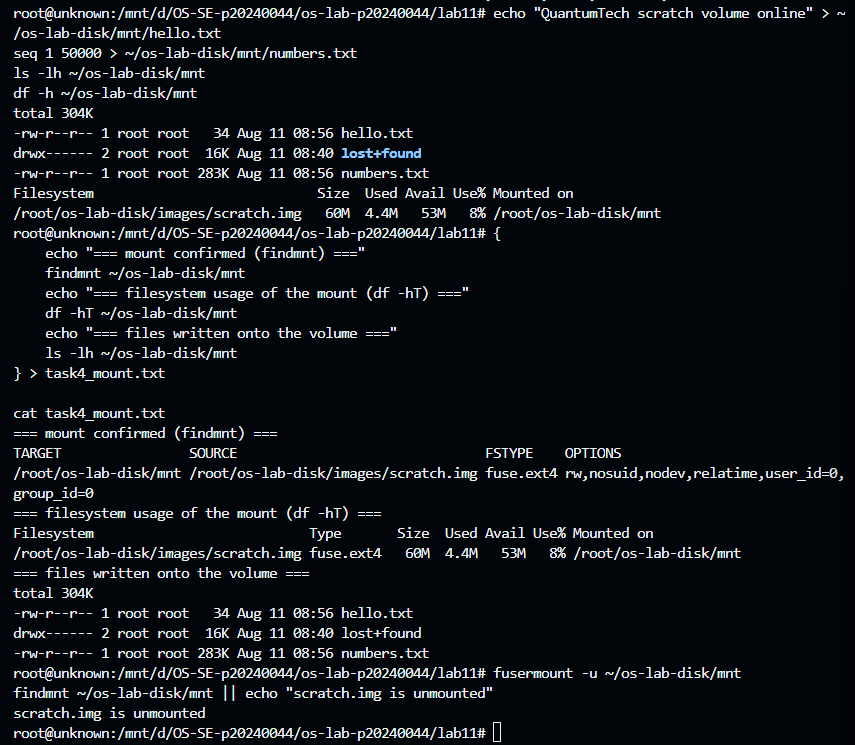
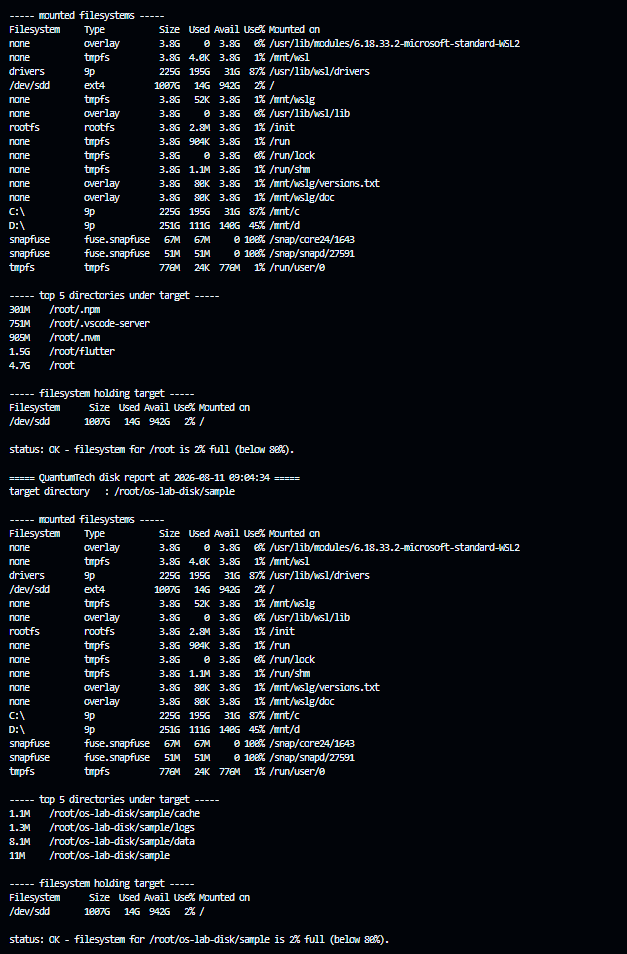
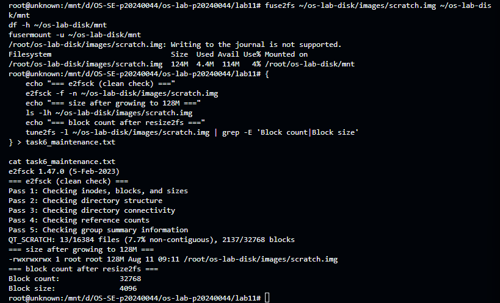
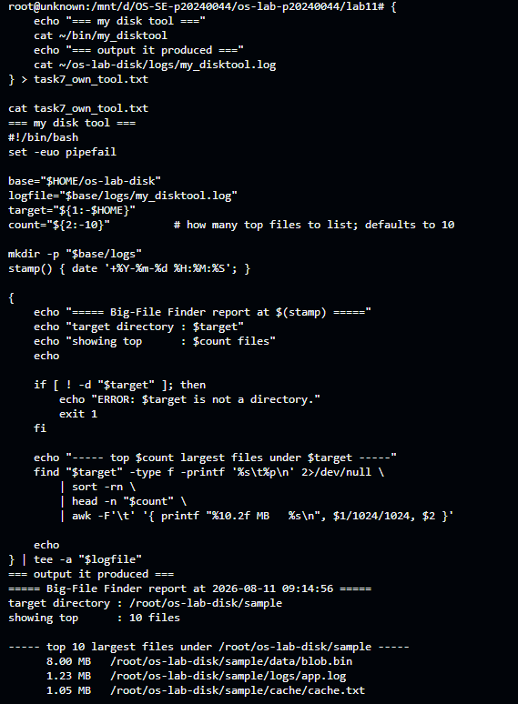
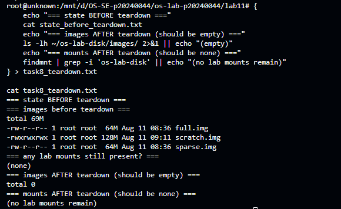

# OS Extra Lab (Bonus) — Linux Disk Management Utilities

**Student:** Chheng Sokuntheary (p20240044)

**Status:** ⭐ This is the Extra/Bonus Lab — optional, no penalty for skipping, bonus points only.

This lab rehearses real Linux storage administration — inventory, usage analysis, image creation, formatting, mounting, a reusable disk-report utility, maintenance/resize, a self-designed diagnostic tool, and teardown — entirely on disk-image files with a normal user account (no sudo), using `fuse2fs` to mount without root.

---

## Level 0 — Storage Inventory

Used `lsblk -f`, `findmnt`, `df -hT`, and `df -i` to see the full storage picture, then identified the filesystem holding `$HOME` (`/dev/sdd`, ext4, mounted at `/`).



---

## Level 1 — Usage Analysis: df vs du

Built a sample tree (`~/os-lab-disk/sample`) with a 200,000-line log, an 8MB binary blob, and a 100,000-line cache file, then compared `df` (filesystem view) against `du` (files view) and found the top consumers.



---

## Level 2 — Create a Virtual Disk Image

Created a sparse image with `truncate` and a fully allocated image with `fallocate`, both 64M. `ls -lh` reported both as 64M, but `du -h` revealed `sparse.img` used 0 bytes of real disk while `full.img` used the full 64M. Also created the working `scratch.img` with `dd`.



---

## Level 3 — Format & Inspect a Filesystem

Formatted `scratch.img` with `mkfs.ext4 -F -L QT_SCRATCH`, then confirmed it with `file`, `blkid`, and `dumpe2fs -h`. Filesystem UUID: `66cd5697-e877-4551-804e-ec5c6fae9be2`, label `QT_SCRATCH`, state `clean`.



---

## Level 4 — Mount Without Root (FUSE)

Mounted `scratch.img` at `~/os-lab-disk/mnt` using `fuse2fs` as a normal user — no sudo required. Wrote `hello.txt` and `numbers.txt` onto the volume, confirmed with `findmnt`/`df -hT` that it was a real `fuse.ext4` mount, then cleanly unmounted with `fusermount -u`.



---

## Level 5 — Build the Disk Utility Script

Wrote `~/bin/disk_report`, a Bash utility that prints mounted filesystems, the top-5 directories under a target (default `$HOME`), the filesystem's usage percentage, and raises an `ALERT` if usage crosses an 80% threshold. Every run appends a timestamped block to `~/os-lab-disk/logs/disk_report.log`.



---

## Level 6 — Maintenance: Check & Grow

Ran `e2fsck -f` on `scratch.img` (clean, no errors). Grew the image from 64M to 128M with `truncate`, re-checked with `e2fsck -f`, then ran `resize2fs` — block count grew from 16384 to 32768 (doubled), block size stayed 4096. Confirmed the resized filesystem still mounts correctly and shows the new capacity.



---

## Level 7 — Design Your Own Disk Tool (Capstone)

Designed and wrote `~/bin/my_disktool` from scratch — a **Big-File Finder** that walks a target directory with `find`, ranks files by size with `sort -rn`, keeps the top N (default 10) with `head`, and converts byte counts to MB with `awk`. Every run appends a timestamped block to `~/os-lab-disk/logs/my_disktool.log`.

Tested against the sample tree and against `$HOME`, where it correctly surfaced real large files across my dev environment (git pack files, Node binaries, VS Code server extensions, and even `scratch.img` itself).



---

## Level 8 — Teardown and Reset

Confirmed nothing was left mounted, recorded the pre-teardown state (three images, 69M total), removed all `.img` files, and confirmed no lab mounts remained and the images folder was empty afterward. Logs were preserved as required.



---

## Lab Questions

**1. What is the difference between `df` and `du`? Give one situation where they would disagree about how much space is used.**

`df` reports how full the _filesystem_ is, based on what the kernel tracks as used/free blocks on the device. `du` adds up the size of the _files_ it can actually see by walking the directory tree. They disagree, for example, when a process has a file open but the file has been deleted — the filesystem still counts those blocks as used (`df` still shows them occupied) even though `du` can no longer see the file to count it, since it no longer has a directory entry.

**2. From Level 2, what was the difference between `ls -lh` and `du -h` for the sparse image, and why? What is a sparse file?**

`ls -lh` reported `sparse.img` as 64M — its apparent/logical size. `du -h` reported it as using 0 real bytes. `truncate` only sets the file's length in metadata without writing actual data blocks, so the filesystem creates "holes" that read back as zeros but were never physically stored. A sparse file is a file whose apparent size is larger than the real disk space it consumes, because unwritten regions are represented as holes rather than physically allocated blocks.

**3. Why could you run `mkfs.ext4` and `e2fsck` on your image without sudo, when formatting a real `/dev/sda1` would require root?**

A real block device like `/dev/sda1` is a shared system resource that could belong to another user or the OS itself, so the kernel restricts write access to root to prevent accidental or malicious damage. My `scratch.img`, however, is just a regular file that I own in my own home directory — ordinary file permissions apply, and since I have read/write access to my own file, no elevated privileges are needed to run `mkfs.ext4 -F` or `e2fsck` against it.

**4. What does `fuse2fs` give you that a normal mount does not, and why is that useful on a shared multi-user server?**

`fuse2fs` lets an unprivileged user mount an ext-family filesystem image entirely in userspace via FUSE, without needing root or the `mount` syscall's usual privilege requirements. On a shared multi-user server, this is valuable because it means students or non-admin users can practice real filesystem mounting workflows without ever needing sudo access, which keeps the shared system safer — no one needs elevated privileges just to rehearse a routine admin task.

**5. In Level 6 you grew the volume in two steps (`truncate` then `resize2fs`). Why are two steps needed, and what would happen if you ran `resize2fs` without first enlarging the image?**

`truncate` only changes the _container's_ size (the raw file), while `resize2fs` changes the _filesystem's_ internal metadata (block count, group descriptors, etc.) to actually use the newly available space. They're separate layers — the filesystem doesn't automatically know the underlying file grew. If I had run `resize2fs` without first enlarging the image with `truncate`, it would have failed (or had nothing to grow into), since there would be no extra space beyond the filesystem's current boundary for it to claim.

**6. Read your `blkid` output: what is a filesystem UUID and why do real systems mount by UUID (in `/etc/fstab`) instead of by device name like `/dev/sdb1`?**

A filesystem UUID (mine: `66cd5697-e877-4551-804e-ec5c6fae9be2`) is a unique identifier generated when the filesystem is created and stored in its metadata — it stays fixed for the life of that filesystem. Device names like `/dev/sdb1` are assigned by the kernel based on detection order at boot, which can change if drives are added, removed, or detected in a different order. Mounting by UUID in `/etc/fstab` guarantees the correct filesystem is always mounted regardless of which device name the kernel happens to assign it that boot.

**7. What does the use% in `df` mean, and why might a filesystem refuse writes before it shows 100% (hint: reserved blocks, inodes)?**

The use% in `df` is the percentage of the filesystem's total blocks currently occupied by data. A filesystem can refuse writes before reaching 100% for two main reasons: ext4 reserves a small percentage of blocks (visible in `dumpe2fs` as "Reserved block count") that only root can use, normally to prevent the root account itself from being locked out during genuine full-disk conditions; and separately, a filesystem can run out of _inodes_ — the metadata structures needed to track each file — well before it runs out of raw block space, especially if it holds many small files, which also blocks further writes even with free bytes remaining.

**8. Describe the tool you wrote in Level 7: what question it answers, which commands it uses, and how you would schedule it to watch storage over time.**

My tool, `my_disktool` (Big-File Finder), answers: _"What are the biggest files under this directory, and how much space is each one using?"_ It uses `find` to list every file's size and path, `sort -rn` to rank them largest-first, `head` to keep the top N (default 10), and `awk` to convert byte counts into MB for readability. Every run appends a timestamped block to `~/os-lab-disk/logs/my_disktool.log` rather than overwriting it, so results build a history. To monitor storage growth over time, I'd schedule it with a crontab entry (the same mechanism used in Lab 10), for example running nightly against a directory prone to bloat:

```
0 2 * * * /root/bin/my_disktool /root/os-lab-disk /root/os-lab-disk/logs
```

That way, if a directory suddenly fills with unexpectedly large files, the log history makes it easy to see exactly when the growth started and which file caused it.

---

_This is the Extra Lab (Bonus) — completing it adds bonus points to the Operating Systems lab total; there is no penalty for having skipped it._
