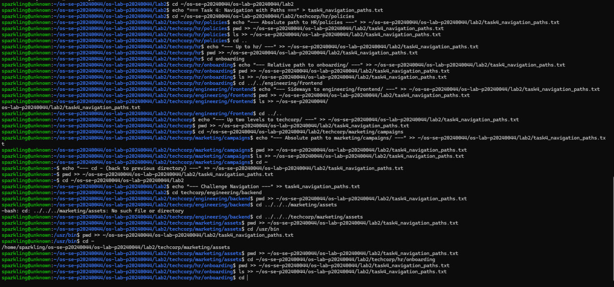
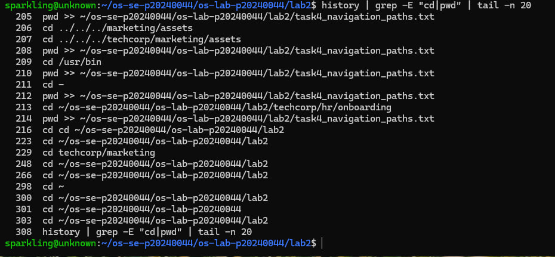
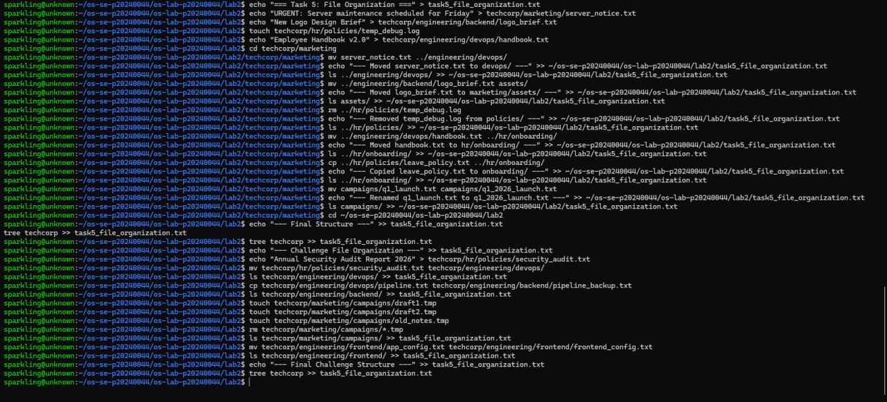
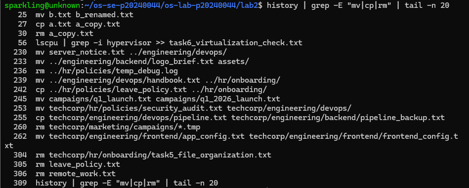
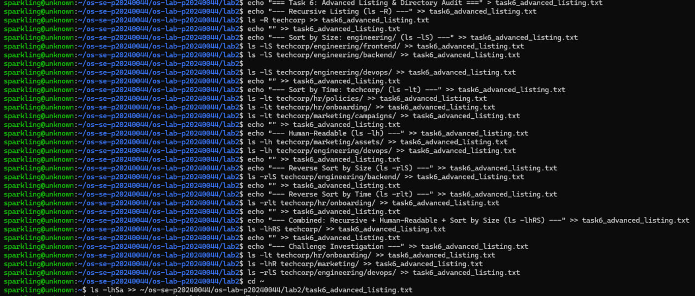
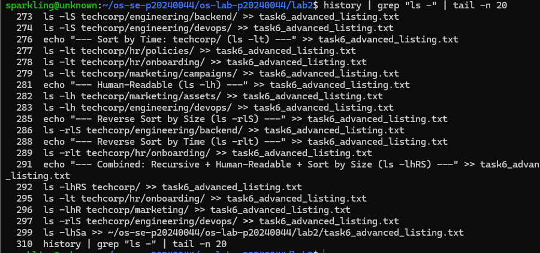
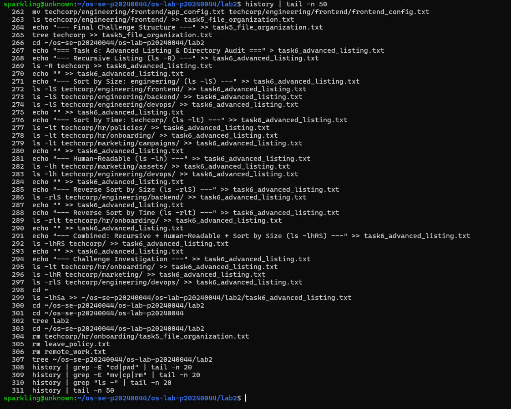

# OS Lab 2 Submission

**Student Name:** [Your Name Here]  
**Student ID:** [Your Student ID Here]

---

## Task Output Files

During the lab, each task redirected its output into .txt files. These files are your primary proof of work for the guided portions of each task. Make sure all of the following files are present in your lab2/ folder:

- [x] task1_basic_navigation.txt
- [x] task2_filesystem_exploration.txt
- [x] task3_directory_structure.txt
- [x] task4_navigation_paths.txt
- [x] task5_file_organization.txt
- [x] task6_advanced_listing.txt

---

## Screenshots

The screenshots below focus on the Challenge sections and command history, since the guided task outputs are already captured in the .txt files above.

### Screenshot 1 — Task 4 Challenge Commands
*Terminal showing navigation commands for challenges 8a–8e with pwd output after each navigation.*



### Screenshot 2 — Task 4 Challenge History
*Command history showing navigation commands used during Task 4 challenge.*



### Screenshot 3 — Task 5 Challenge Commands
*Terminal showing mv, cp, rm, and rename commands for challenges 9a–9d with ls output confirming each action.*



### Screenshot 4 — Task 5 Challenge History
*Command history showing file management commands used during Task 5 challenge.*



### Screenshot 5 — Task 6 Challenge Commands
*Terminal showing ls flag combinations for challenges 6a–6d with their output.*



### Screenshot 6 — Task 6 Challenge History
*Command history showing ls commands used during Task 6 challenge.*



### Screenshot 7 — Full Command History
*Complete trail of commands executed during the entire lab session.*



---

## Lab Completion Summary

### Task 1: Basic Navigation Warm-Up
Successfully navigated between home directory, root directory, and lab2 folder using `cd`, `pwd`, and `ls` commands. Output recorded in `task1_basic_navigation.txt`.

### Task 2: Exploring the File System
Explored key system directories including `/`, `/etc`, `/var`, `/home`, and `/tmp`. Documented their contents and purpose. Output recorded in `task2_filesystem_exploration.txt`.

### Task 3: Building the Company Directory Structure
Created complete directory structure for TechCorp with HR, Engineering, and Marketing departments including all subdirectories and placeholder files. Verified structure using `tree` command. Output recorded in `task3_directory_structure.txt`.

### Task 4: Navigating with Absolute and Relative Paths
Successfully navigated using:
- Absolute paths to reach HR policies folder
- Relative paths and `..` shortcuts to move between directories
- `cd -` to return to previous directory
- **Challenge:** Navigated independently to various locations including `/usr/bin` and back to TechCorp directories

Output recorded in `task4_navigation_paths.txt`.

### Task 5: Organizing Files Across Directories
Completed file organization tasks:
- Moved misplaced files between departments
- Copied policy files to onboarding directories
- Removed temporary and junk files
- Renamed files for consistency
- **Challenge:** Independently fixed more misplaced files including creating, moving, copying, removing, and renaming operations

Output recorded in `task5_file_organization.txt`.

### Task 6: Advanced Listing & Directory Audit
Applied advanced `ls` options:
- `ls -R` for recursive listing
- `ls -lS` for size-sorted listing
- `ls -lt` for time-sorted listing
- `ls -lh` for human-readable sizes
- Combined flags for comprehensive analysis
- **Challenge:** Investigated file system to find newest files, smallest files, and hidden files with specific sorting requirements

Output recorded in `task6_advanced_listing.txt`.

---

## Commands Executed During Challenge Sections

### Task 4 Challenge (8a-8e)
The following commands were used to navigate the file system independently:

**8a:** Navigate to `techcorp/engineering/backend` using relative path
```bash
cd techcorp/engineering/backend
pwd