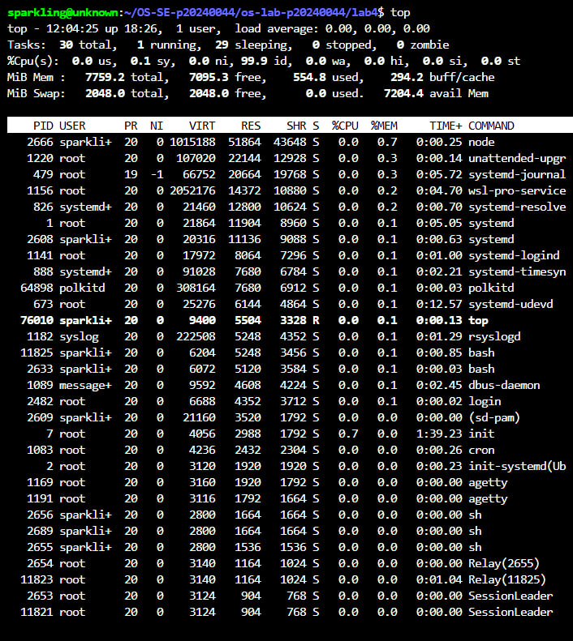
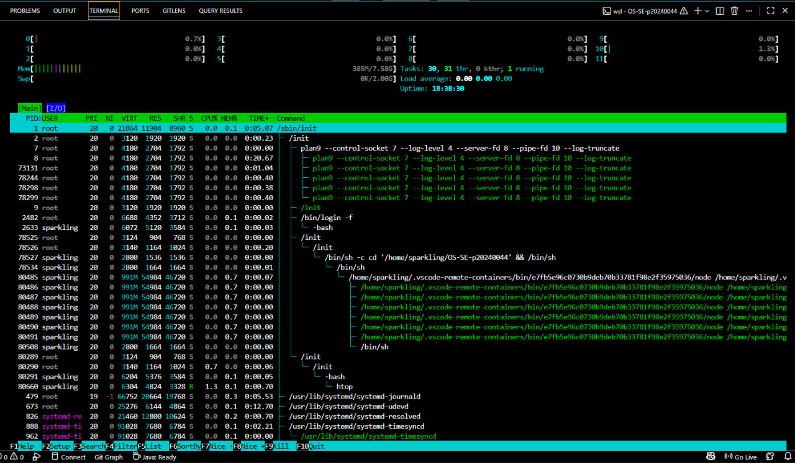
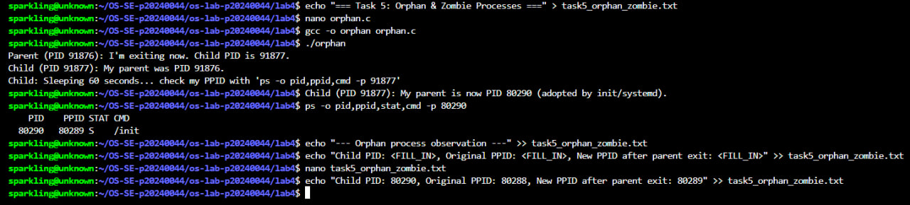
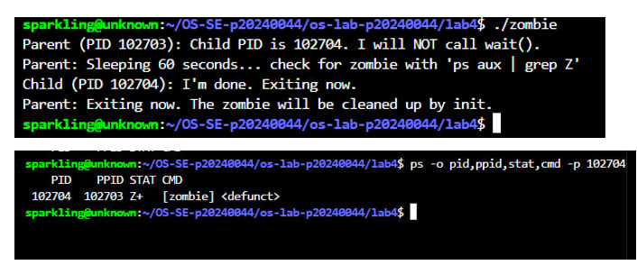
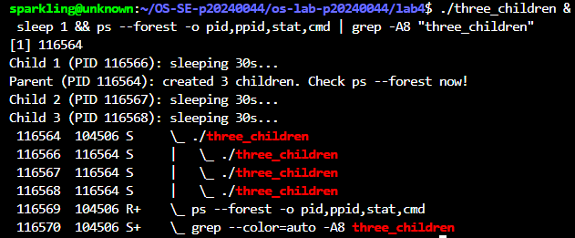

# Lab 4 — I/O Redirection, Pipelines & Process Management

| | |
|---|---|
| **Student Name** | Chheng Sokuntheary |
| **Student ID** | p20240044 |

## Task Completion

| Task | Output File | Status |
|------|-----------|--------|
| Task 1: I/O Redirection | `task1_redirection.txt` | ✅ |
| Task 2: Pipelines & Filters | `task2_pipelines.txt` | ✅ |
| Task 3: Data Analysis | `task3_analysis.txt` | ✅ |
| Task 4: Process Management | `task4_processes.txt` | ✅ |
| Task 5: Orphan & Zombie | `task5_orphan_zombie.txt` | ✅ |

## Screenshots

### Task 4 — `top` Output

### Task 4 — `htop` Tree View

### Task 5 — Orphan Process (`ps` showing PPID = 1)

### Task 5 — Zombie Process (`ps` showing state Z)

### Task 5 Challenge — Process Tree with 3 Children

## Answers to Task 5 Questions

1. **How are orphans cleaned up?**
   > When a parent process exits before its child, the kernel automatically re-parents the orphan to init (PID 1) or systemd. Init periodically calls wait() to clean up any orphaned children that finish.

2. **How are zombies cleaned up?**
   > The parent must call wait() or waitpid() to read the child's exit status. Once the parent calls wait(), the kernel removes the zombie entry from the process table. If the parent never calls wait(), the zombie persists until the parent exits, then init cleans it up.

3. **Can you kill a zombie with `kill -9`? Why or why not?**
   > No. A zombie process is already dead and has no running code to receive or handle any signals. kill -9 (SIGKILL) only works on running processes. The zombie entry is just a record remaining in the process table waiting for its parent to call wait().

## Reflection

> The most useful technique I learned in this lab was combining pipes and redirection to build powerful data processing pipelines. Instead of manually scrolling through terminal output, I can chain commands like `grep`, `awk`, `cut`, `sort`, and `uniq` to instantly filter and analyze data. In a real server environment, these skills are essential — for example, analyzing web server access logs to find failed requests, monitoring which processes are consuming the most CPU or memory, and redirecting error logs to separate files for easier debugging. Understanding process management with signals, background jobs, and orphan/zombie processes also gave me a much clearer picture of how Linux handles process lifecycles.
