# OS Lab 6 Submission — Linux Security, Users, Groups & File Permissions
- **Student Name:** [Your Name Here]
- **Student ID:** p20240044

---
## Task Output Files
- [x] `task1_users.txt`
- [x] `task2_groups.txt`
- [x] `task3_permissions.txt`
- [x] `task3_stat_output.txt`
- [x] `task4_special_bits.txt`
- [x] `task5_acl.txt`
- [x] `security_lab/whoami_suid.c`

---
## Screenshots

### Screenshot 1 — Task 1: User Creation
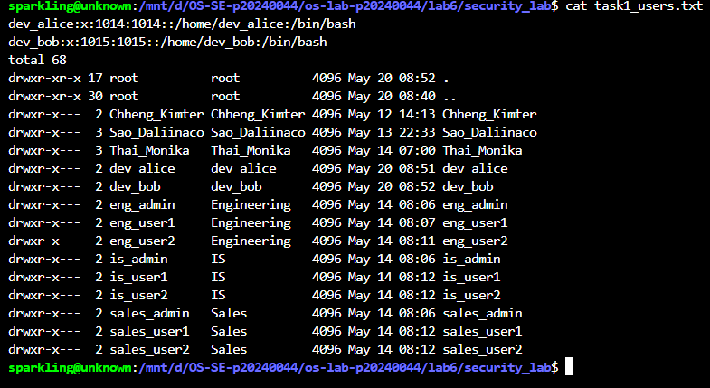

### Screenshot 2 — Task 1: User Modification
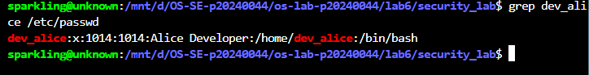

### Screenshot 3 — Task 2: Group Setup
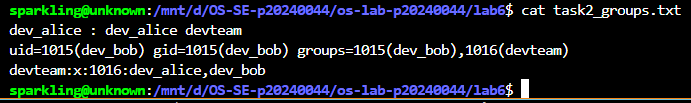

### Screenshot 4 — Task 2: Multiple Group Membership
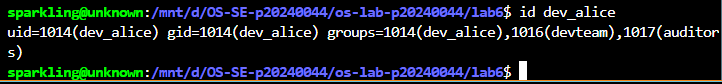

### Screenshot 5 — Task 3: Directory Permissions
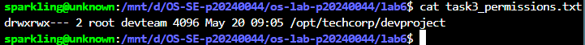

### Screenshot 6 — Task 3: Access Denied
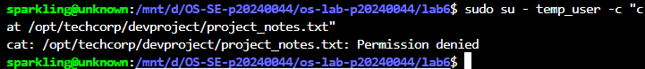

### Screenshot 7 — Task 4: setgid Bit
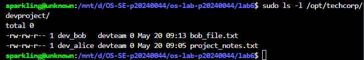

### Screenshot 8 — Task 4: Sticky Bit
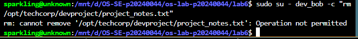

### Screenshot 9 — Task 4: setuid Bit
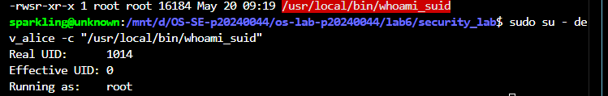

### Screenshot 10 — Task 5: ACL Directory
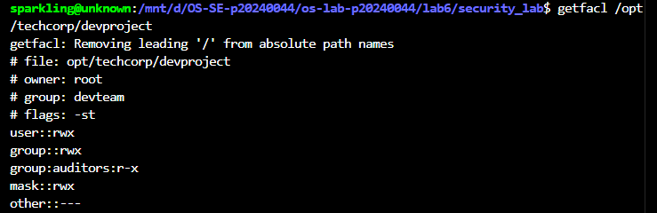

### Screenshot 11 — Task 5: ACL Access Test
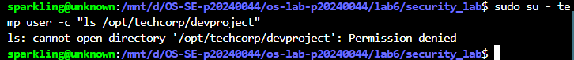

### Screenshot 12 — Task 5: ACL Output File
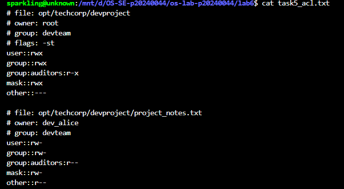

---
## Answers to Lab Questions

1. **What is the difference between `userdel` and `userdel -r`?**
   > `userdel` removes only the user account entry from `/etc/passwd`, `/etc/shadow`, and `/etc/group`, but leaves the home directory intact on disk. `userdel -r` does the same and also recursively deletes the user's home directory and mail spool, completely removing all traces of the account.

2. **Why is it safer to use `visudo` instead of directly editing `/etc/sudoers`?**
   > `visudo` locks the file to prevent simultaneous edits and validates the syntax before saving. A syntax error in `/etc/sudoers` can lock every user out of `sudo` entirely, making the system unrecoverable without root access. `visudo` catches mistakes before writing the file.

3. **What happens when a `setgid` directory contains files created by different users? What benefit does this provide for team collaboration?**
   > When `setgid` is set on a directory, any new file created inside inherits the directory's group rather than the creating user's primary group. This means all team members can read and write each other's files without manual `chown` or `chgrp` — perfect for shared project directories.

4. **What limitation of standard Unix permissions does the ACL system solve?**
   > Standard Unix permissions only allow one owner and one group per file. ACLs solve this by allowing additional fine-grained rules for multiple users or groups. In this lab, the `auditors` group was granted separate read-only access via ACL without changing the directory's primary group.
