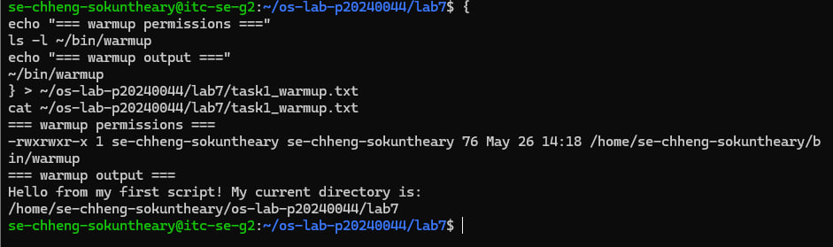
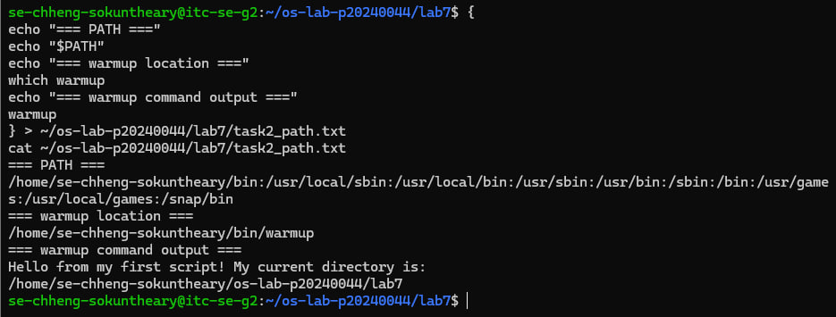
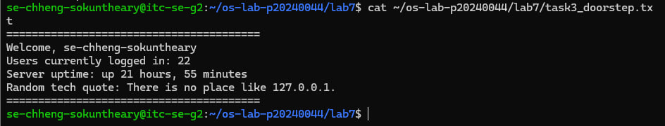
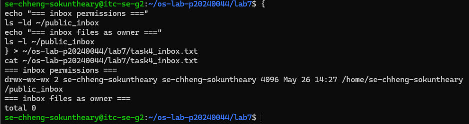
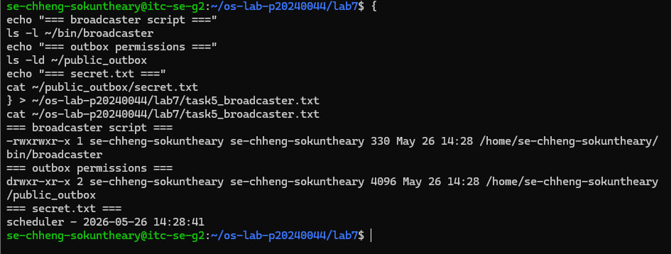
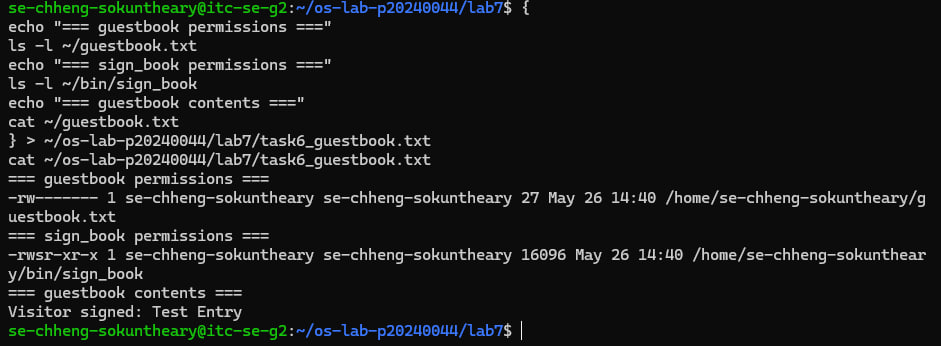
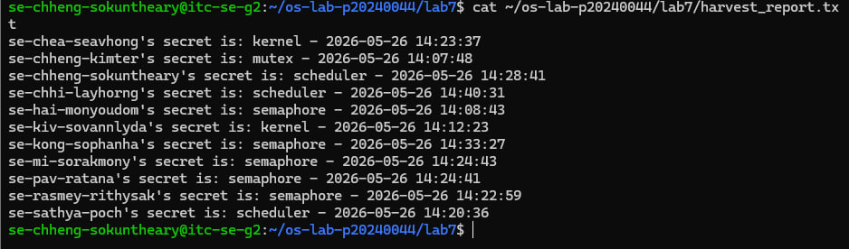
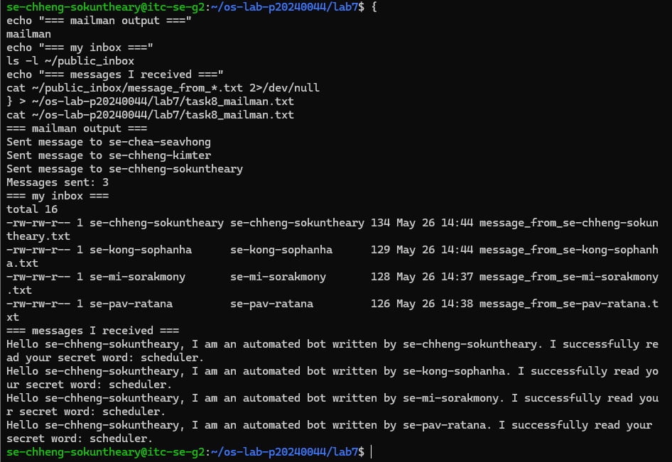

# OS Lab 7 Submission — Bash Scripting, Permissions & Server Automation
- **Student Name:** Chheng Sokuntheary 
- **Student ID:** p20240044
---
## Screenshots
Insert your screenshots below.
### Screenshot 1 — Task 1: Warm-Up Script
Show `cat task1_warmup.txt` with the executable `warmup` script and successful output.

---
### Screenshot 2 — Task 2: PATH Setup
Show `cat task2_path.txt` with your `PATH`, `which warmup`, and running `warmup` by name.

---
### Screenshot 3 — Task 3: Doorstep Message
Show `cat task3_doorstep.txt` with username, users online, uptime, and random quote.

---
### Screenshot 4 — Task 4: Secure Mailbox
Show `cat task4_inbox.txt` with `public_inbox` permissions and a test file from a classmate.

---
### Screenshot 5 — Task 5: Broadcaster
Show `cat task5_broadcaster.txt` with the broadcaster script evidence and `secret.txt`.

---
### Screenshot 6 — Task 6: VIP Guestbook
Show `cat task6_guestbook.txt` with guestbook permissions, SUID binary permissions, and guestbook contents.

---
### Screenshot 7 — Task 7: Data Harvester
Show `cat harvest_report.txt` containing secrets collected from classmates.

---
### Screenshot 8 — Task 8: Mailman Bot
Show `cat task8_mailman.txt` with mailman output and messages received in your inbox.

---
## Answers to Lab Questions

1. **Why did `warmup` fail before you added execute permission?**
   > Linux requires the execute (`x`) bit to be set before the kernel allows a file to run as a program. Without it, the file is treated as plain data and the shell returns "Permission denied" even if the file content is a valid script.

2. **What does adding `~/bin` to `PATH` allow you to do?**
   > It allows scripts inside `~/bin` to be run by typing just their name from any directory, without needing to type the full path like `~/bin/warmup` or a relative path like `./warmup`. The shell searches every directory in PATH from left to right when a command is typed.

3. **Why does `chmod 733 public_inbox` allow classmates to drop files but not list the inbox?**
   > The permission `3` for group and others gives write (`2`) and execute (`1`) but not read (`4`). On a directory, execute means the user can enter and create files inside it, while the missing read bit means they cannot list the contents. This is like a physical mailbox slot — you can drop something in but cannot see what else is inside.

4. **Why does Linux ignore SUID on shell scripts, and why did we use a compiled C program instead?**
   > Linux ignores SUID on interpreted scripts as a security measure. The kernel would need to hand control to an interpreter (like bash) before knowing what code will run, creating privilege escalation risks. With a compiled C binary, the kernel loads and runs it directly, so the SUID privilege is safely enforced at execution time.

5. **What is the difference between `>` and `>>` in Bash redirection?**
   > `>` overwrites the file completely each time, erasing all existing content (and creates the file if it does not exist). `>>` appends to the end of the file, preserving all existing content and adding new output after it.

6. **How did your `harvester` avoid reading files that were missing or not readable?**
   > It used a double condition: `[ -f "$target_file" ] && [ -r "$target_file" ]`. The `-f` test checks the file exists and is a regular file. The `-r` test checks that the current user has read permission on it. Both conditions must be true before the script attempts to read the file — if either fails, that user is silently skipped.

7. **What permission problems did you or your classmates need to fix during the lab?**
   > The home directory needed `chmod 711` to allow others to traverse into it and reach `~/bin/sign_book`. The `public_inbox` needed `chmod 733` for write-only access. The `public_outbox` needed `chmod 755` and `secret.txt` needed `chmod 644` so the harvester could read it. Without `chmod 711` on the home directory, even correctly permissioned subdirectories were unreachable.

---
## Reflection
> This lab taught me how Linux permissions control access at every level — files, directories, and even executables. Combining scripting with permissions showed how automation can be both powerful and safe on a shared server. The SUID task demonstrated how privilege can be granted precisely without giving full access, and the harvester and mailman scripts showed how bots can interact across user boundaries within the rules set by permissions.
