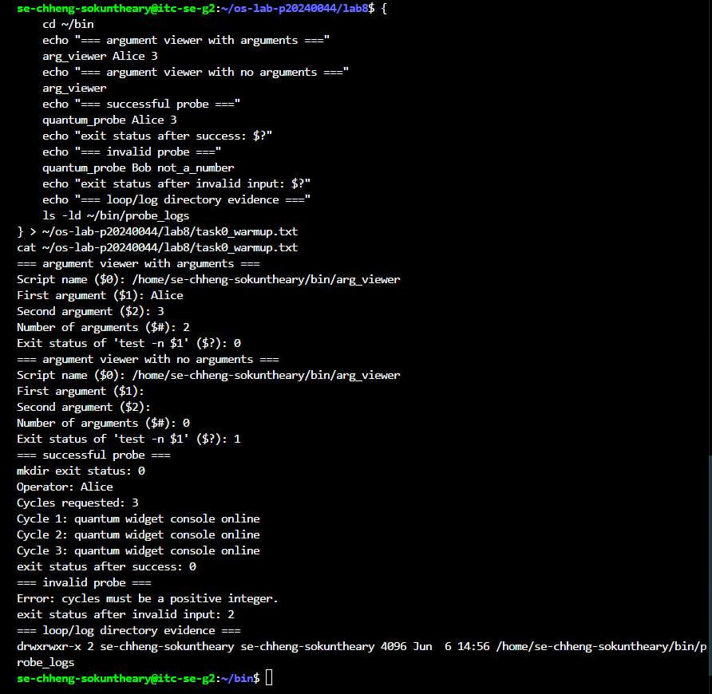
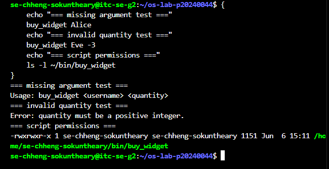
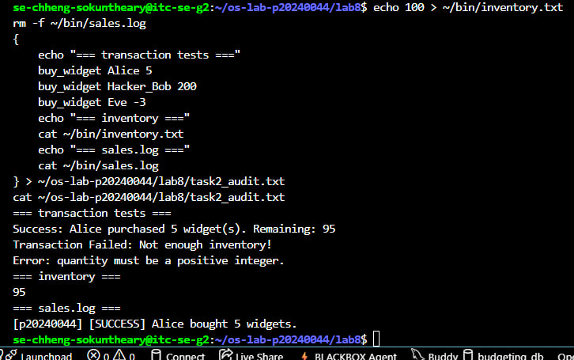
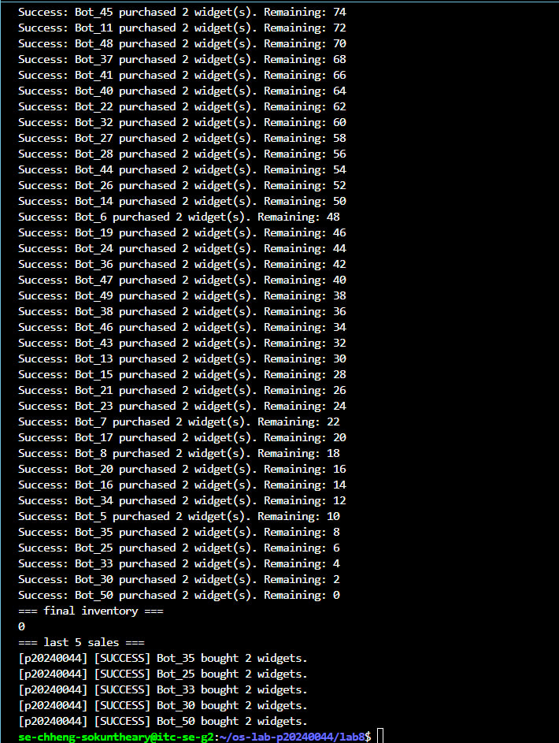
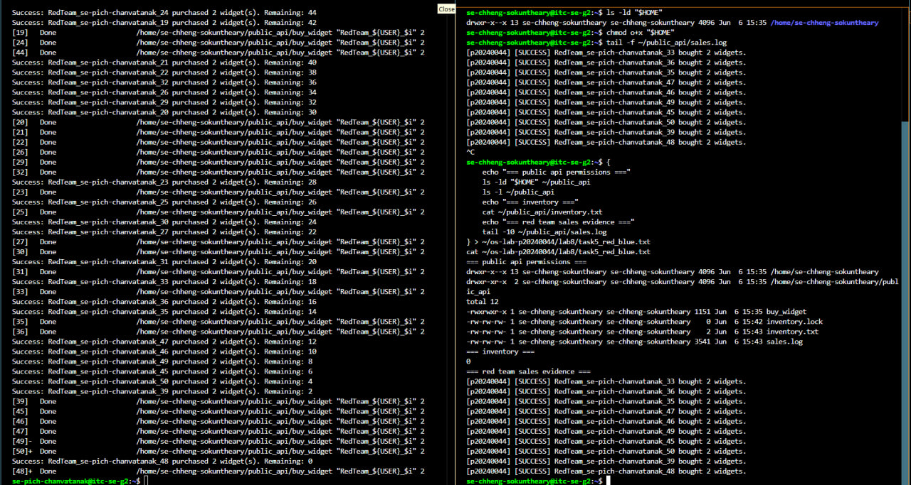
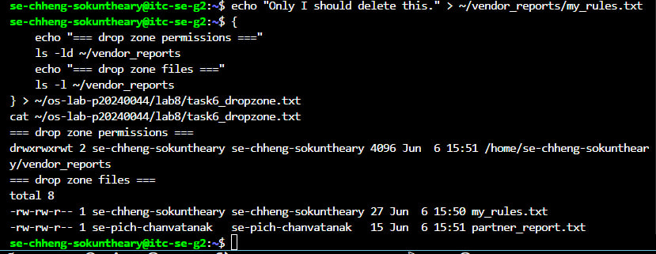
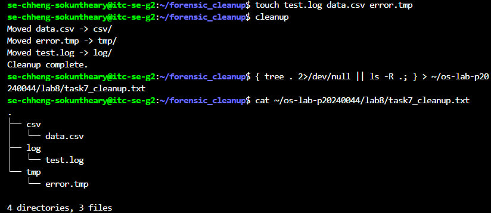

# OS Lab 8 Submission - The Quantum Widget Exploit

- **Student Name:** Chheng Sokuntheary
- **Student ID:** p20240044
- **Partner Username:** se-pich-chanvatanak

---

## Task Output Files

- [x] `observations.txt`
- [x] `task0_warmup.txt`
- [x] `task1_validation.txt`
- [x] `task2_audit.txt`
- [x] `task4_mutex.txt`
- [x] `task5_red_blue.txt`
- [x] `task6_dropzone.txt`
- [x] `task7_cleanup.txt`
- [x] `scripts/arg_viewer`
- [x] `scripts/quantum_probe`
- [x] `scripts/buy_widget`
- [x] `scripts/bot_swarm`
- [x] `scripts/create_dropzone`
- [x] `scripts/cleanup`

---

## Screenshots

### Screenshot 1 - Level 0: Bash Warm-Up Scripts

Show `arg_viewer` explaining `$0`, `$1`, `$2`, `$#`, and `$?`, then show `quantum_probe` using a condition and a loop.

---

### Screenshot 1B - Level 1: Input Validation (Optional)

Show missing argument rejection and invalid quantity rejection.

---

### Screenshot 2 - Level 2: Audit Trails

Show input validation, a successful sale, failed transactions, final inventory, and `sales.log`.

---

### Screenshot 3 - Level 4: Mutex Patch

Show `inventory.txt` exactly `0` after the patched `bot_swarm`, plus the last five lines of `sales.log`.

---

### Screenshot 4 - Level 5: Red Team vs. Blue Team

Show `public_api` permissions, inventory, and sales log evidence that your classmate executed your API.

---

### Screenshot 5 - Level 6: Secure Drop Zone

Show the sticky bit in `ls -ld` output and evidence that your partner could not delete your file.

---

### Screenshot 6 - Level 7: Forensic Cleanup

Show `tree` or `ls -R` output proving `.log`, `.csv`, and `.tmp` files were sorted into folders.

---

## Race Condition Observations

Summarize your five vulnerable `bot_swarm` runs from `observations.txt`:

| Run | Final Inventory | Notes |
|:---:|----------------:|-------|
| 1 | 86 | Expected 0, got 86 — race condition |
| 2 | 86 | Expected 0, got 86 — race condition |
| 3 | 86 | Expected 0, got 86 — race condition |
| 4 | 86 | Expected 0, got 86 — race condition |
| 5 | 90 | Expected 0, got 90 — different result each run |
| 6 | 88 | Expected 0, got 88 — non-deterministic |

---

## Answers to Lab Questions

1. **In `arg_viewer`, what did `$0`, `$1`, `$2`, `$#`, and `$?` mean when you ran the script?**

   > When running `arg_viewer Alice 3`: `$0` was the full script path (`/home/se-chheng-sokuntheary/bin/arg_viewer`), `$1` was `Alice` (first argument), `$2` was `3` (second argument), `$#` was `2` (total number of arguments), and `$?` was `0` because `test -n "Alice"` succeeded — Alice is non-empty. When run with no arguments, `$1` and `$2` were blank, `$#` was `0`, and `$?` was `1` because `test -n ""` fails on an empty string.

2. **What does TOC-TOU mean, and where did it appear in the vulnerable `buy_widget` script?**

   > TOC-TOU stands for Time-of-Check to Time-of-Use. It is a race condition where the state of a shared resource changes between when a process checks it and when it uses it. In the vulnerable `buy_widget`, the script reads `inventory.txt` (time of check) and then writes the new value back (time of use). Between those two operations, 50 concurrent bot processes can all read the same inventory value simultaneously, all believe there is enough stock, and all subtract from the same starting number — causing the inventory to be written incorrectly by the last process to finish.

3. **Why did `bot_swarm` sometimes leave inventory values other than `0` before the patch?**

   > The OS scheduler runs all 50 bot processes concurrently without any ordering guarantee. Without a mutex, multiple processes read `inventory.txt` at the exact same moment, all seeing the same value. Each then independently calculates a new inventory value and overwrites the file. The last write wins, discarding all earlier writes. This means many purchases are effectively lost and the final inventory reflects only the last few writes. The result is non-deterministic — we got values like 86, 88, and 90 instead of 0, and the value changed every run depending on scheduling order.

4. **What part of the script is the critical section, and why must it be protected?**

   > The critical section is the sequence: read `inventory.txt` → check if enough stock exists → calculate the new value → write new value to `inventory.txt` → append to `sales.log`. This entire sequence must execute atomically — no other process should be able to read or write the inventory file while it is in progress. If interrupted by another process at any step, the shared state becomes inconsistent, leading to overselling, incorrect counts, or lost transactions.

5. **How does `flock -x` enforce mutual exclusion between concurrent processes?**

   > `flock -x 200` acquires an exclusive lock on file descriptor 200, which is attached to `inventory.lock` via `200> inventory.lock`. When one process holds the exclusive lock, any other process that calls `flock -x 200` on the same lock file is blocked by the OS kernel and must wait. This is not a Bash-level check but a real OS-level file lock. Once the first process finishes its critical section and the subshell exits, the lock is automatically released and the next waiting process proceeds. After the patch, `bot_swarm` always ended with inventory exactly `0`.

6. **Which permissions did you use to let a classmate run your API without giving full access to your home directory?**

   > - `chmod o+x "$HOME"` — allows others to traverse (enter) the home directory without listing its contents.
   > - `chmod 755 ~/public_api` — makes the `public_api` folder readable and executable by everyone.
   > - `chmod o+rx ~/public_api/buy_widget` — allows others to read and execute the script.
   > - `chmod o+rw ~/public_api/inventory.txt ~/public_api/sales.log ~/public_api/inventory.lock` — allows others to read and write only the shared data files the script needs.
   > This follows the principle of least privilege — only the minimum permissions needed were granted. Partner `se-pich-chanvatanak` successfully ran 50 purchases against our API and all transactions were logged correctly.

7. **Why does the sticky bit protect files in a shared drop zone?**

   > The sticky bit (`chmod +t`) on a directory means that even though all users can write to the directory, a user can only delete or rename files that they own. Without the sticky bit, any user with write access to the directory can delete any file inside it, even files owned by others. With the sticky bit set (shown as `t` in `drwxrwxrwt`), only the file owner or root can delete their own files. This is why `/tmp` uses the sticky bit — it is world-writable but each user's files are safe from deletion by other users.

8. **What defensive scripting practice from this lab would you use in a real production script?**

   > The most important practice is always validating input before using it — rejecting anything that is not a positive integer or in an expected format using regex `[[ "$var" =~ ^[1-9][0-9]*$ ]]`. The second most important is using `flock` for any script that reads and writes a shared file, because concurrent executions are common in production cron jobs and APIs. Anchoring all file paths with `script_dir="$(cd "$(dirname "${BASH_SOURCE[0]}")" && pwd)"` prevents the script from breaking when called from a different working directory. Logging every transaction with a student or user ID creates an audit trail essential for incident response.

---

## Reflection

> This lab made the connection between Bash scripts and OS-level concepts very concrete. Level 3 was the most eye-opening — seeing the inventory end at inconsistent values like 86, 88, and 90 instead of 0 demonstrated exactly why race conditions are dangerous in any concurrent system. The fix in Level 4 using `flock` showed that the OS kernel itself provides the locking primitive — Bash just needs to call it correctly. Level 5 was particularly interesting because our partner `se-pich-chanvatanak` ran 50 concurrent purchases against our account from their own terminal, and the inventory counted down perfectly from 100 to 0 with no errors — proving that `flock` works across user boundaries. Level 6 reinforced that Unix permissions are a precise tool for controlled sharing — the sticky bit difference between "can write to a directory" and "can delete files in a directory" is exactly the kind of subtle distinction that causes real security incidents. The overall lesson is that a script is not just code — it is a process that the OS schedules, and any shared resource it touches must be treated as a potential race condition.
