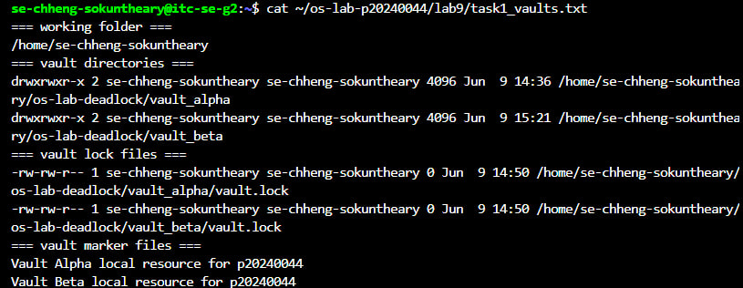
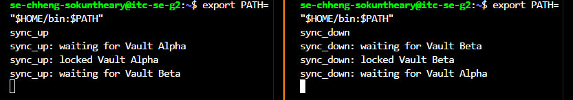
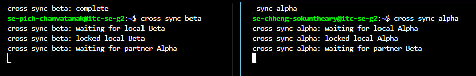
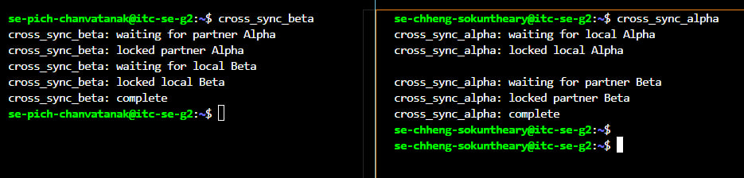
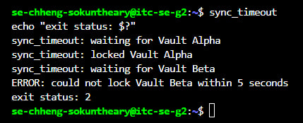
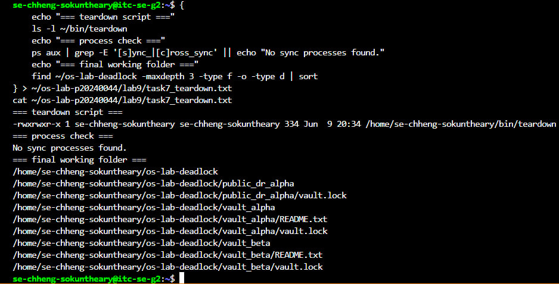

# OS Lab 9 Submission - The Quantum Vault Deadlock
- **Student Name:** Chheng Sokuntheary
- **Student ID:** p20240044
- **Linux Username:** se-chheng-sokuntheary
- **Partner Username:** se-pich-chanvatanak
- **My Role:** Player A

---

## Required Working Files Outside the Repo
Confirm these files and folders existed while you ran the lab:
- [x] `~/bin/sync_up`
- [x] `~/bin/sync_down`
- [x] `~/bin/sync_timeout`
- [x] `~/bin/teardown`
- [x] `~/bin/cross_sync_alpha`
- [x] `~/os-lab-deadlock/README.md`
- [x] `~/os-lab-deadlock/vault_alpha/README.txt`
- [x] `~/os-lab-deadlock/vault_alpha/vault.lock`
- [x] `~/os-lab-deadlock/vault_beta/README.txt`
- [x] `~/os-lab-deadlock/vault_beta/vault.lock`
- [x] `~/os-lab-deadlock/public_dr_alpha/vault.lock`

---

## Task Output Files
Make sure all of the following files are present in your `lab9/` folder:
- [x] `task1_vaults.txt`
- [x] `task2_sync_scripts.txt`
- [x] `task3_local_deadlock.txt`
- [x] `task4_cross_deadlock.txt`
- [x] `task5_ordering_patch.txt`
- [x] `task6_timeout_recovery.txt`
- [x] `task7_teardown.txt`
- [x] `scripts/sync_up`
- [x] `scripts/sync_down`
- [x] `scripts/sync_timeout`
- [x] `scripts/teardown`
- [x] `scripts/cross_sync_alpha`

---

## Screenshots
Insert your screenshots below.

### Screenshot 1 - Level 1: Vault Workspace Setup
Show `vault_alpha`, `vault_beta`, and their `vault.lock` files.

---

### Screenshot 2 - Level 3: Local Deadlock
Show frozen `sync_up` and `sync_down` terminals or process evidence.

---

### Screenshot 3 - Level 4: Site-to-Site Deadlock
Show partner cross-site scripts frozen in circular wait.

---

### Screenshot 4 - Level 5: Global Resource Ordering Patch
Show ordered locking completing without deadlock.

---

### Screenshot 5 - Level 6: Timeout Recovery
Show the timeout error and nonzero exit status.

---

### Screenshot 6 - Level 7: Cleanup and Reset
Show the process check and final working tree.

---

## Deadlock Observation Table
| Level | Script A Held | Script A Waited For | Script B Held | Script B Waited For | Result |
|:----:|---------------|---------------------|---------------|---------------------|--------|
| 3 | Vault Alpha | Vault Beta | Vault Beta | Vault Alpha | Deadlock - both frozen forever |
| 4 | public_dr_alpha | public_dr_beta | public_dr_beta | public_dr_alpha | Deadlock - both frozen forever |
| 5 | public_dr_alpha | public_dr_beta | public_dr_alpha | public_dr_beta | No deadlock - both completed |

---

## Answers to Lab Questions

1. **What does each `vault.lock` file represent in this lab?**
   > Each `vault.lock` file represents an exclusive shared resource — specifically a vault that only one process can access at a time. It simulates a real OS resource like a device or database that must be locked before use.

2. **Why does `flock` require every script to lock the same shared file to coordinate correctly?**
   > Because `flock` works by placing a lock on a specific file. If two scripts open different files, they are not competing for the same resource and will not coordinate. Both scripts must open the exact same file path to detect that the other holds the lock.

3. **In the local deadlock, which resource did `sync_up` hold, and which resource did it wait for?**
   > `sync_up` held Vault Alpha and waited for Vault Beta.

4. **In the local deadlock, which resource did `sync_down` hold, and which resource did it wait for?**
   > `sync_down` held Vault Beta and waited for Vault Alpha.

5. **Which four deadlock conditions were present in Level 3?**
   > 1. Mutual Exclusion: each vault lock can only be held by one process at a time.
   > 2. Hold and Wait: each script held one lock while waiting for the other.
   > 3. No Preemption: neither script could take the lock from the other by force.
   > 4. Circular Wait: sync_up waited for sync_down's resource, and sync_down waited for sync_up's resource.

6. **How does the global Alpha-before-Beta ordering rule break circular wait?**
   > When both scripts always lock Alpha first, neither script can hold Beta while waiting for Alpha. One script grabs Alpha and proceeds to Beta. The other script waits for Alpha instead of holding Beta, so the circular chain is broken and deadlock cannot form.

7. **Why is `flock -w` useful for recovery even though it does not prevent every deadlock?**
   > Because it gives a script a bounded waiting time. Instead of waiting forever, the script gives up after the timeout, releases what it holds, and exits with an error. This allows the system to detect the problem and retry or alert an operator, rather than hanging indefinitely.

8. **Why should you check for stuck processes before finishing a deadlock lab?**
   > Because stuck processes keep holding lock files open. If you leave them running, the next person who runs the scripts will immediately deadlock again because the locks are still held. Cleaning up ensures the system is in a known good state.

---

## Reflection
> This lab taught me how deadlocks form in real operating systems through circular wait between processes competing for shared resources. I learned how flock simulates exclusive resource access using lock files, and how running two scripts in opposite lock orders creates a deadlock that neither can escape on its own. The global ordering fix showed me that a simple consistent rule across all processes is enough to eliminate circular wait entirely. The timeout recovery showed me that even without preventing deadlock, a system can be made more robust by failing fast and clearly instead of hanging forever. Checking for stuck processes at the end reminded me that cleanup is just as important as the lab itself in real system administration.
