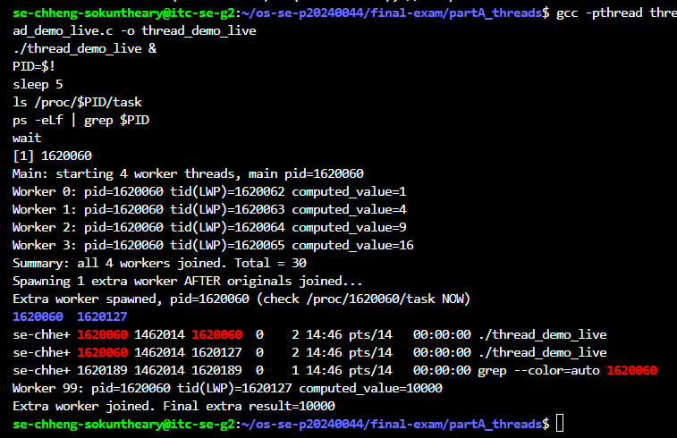
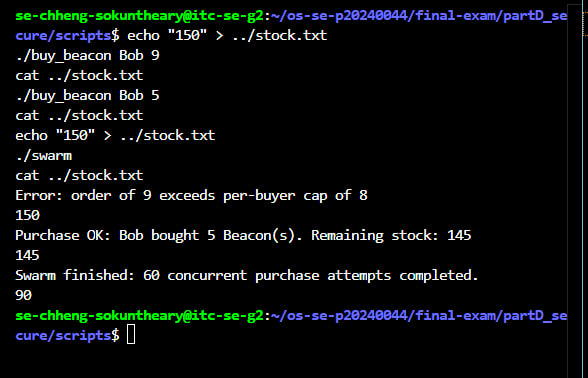
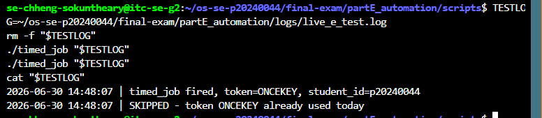

# live_mods.md — Live Modification (curveball) answers

## Curveball A — extra worker(s) that start after the others join

- **Issued value:** 1 extra worker
- **Announced instruction:** Edit thread_demo.c to spawn this many extra workers that start only after the originals have joined; show the new LWP(s) appear in the mapping then disappear.
- **Live value(s) I acted on:** base PID = 1620060; original LWPs = 1620062,1620063,1620064,1620065 (joined and gone by capture time); new extra LWP that appeared = 1620127
- **Commands:**

```bash
cp thread_demo.c thread_demo_live.c
# edited main(): after original join loop + summary print, spawn 1 extra worker (id=99),
# print its pid, join it. Added sleep(3) inside worker() so it stays alive to inspect.
gcc -pthread thread_demo_live.c -o thread_demo_live
./thread_demo_live &
PID=$!
sleep 5
ls /proc/$PID/task
ps -eLf | grep $PID
wait
```

- **Result:** /proc/1620060/task showed only "1620060 1620127" — the 4 original LWPs had
  already exited/joined, and only the new extra LWP (1620127) was alive alongside main,
  proving the extra worker started only after originals joined, and that its LWP appears
  then disappears once it too is joined.

- **Screenshot:**



---

## Curveball D — per-buyer purchase cap

- **Issued value:** cap = 8
- **Announced instruction:** Add a per-buyer purchase cap to buy_beacon — reject any single order above it; re-run swarm and show the locked result respects the cap and stays consistent.
- **Live value(s) I acted on:** stock before = 150; order rejected for exceeding cap = qty 9 (Bob); order accepted = qty 5 (Bob), new_stock=145; final swarm stock = 90
- **Commands:**

```bash
# added CAP=8 check in buy_beacon, placed BEFORE the flock-protected critical section
echo "150" > ../stock.txt
./buy_beacon Bob 9     # rejected: "Error: order of 9 exceeds per-buyer cap of 8"
cat ../stock.txt        # 150 (untouched)
./buy_beacon Bob 5     # accepted: stock -> 145
cat ../stock.txt
echo "150" > ../stock.txt
./swarm
cat ../stock.txt        # 90 (still correct/deterministic)
```

- **Result:** the cap correctly rejects any single order above 8 before the locked
  critical section runs (stock unaffected by rejected orders), while the swarm
  (60 buyers x qty 1, all within cap) still lands deterministically on the correct
  value of 90 — proving the cap and the flock lock work together correctly.

- **Screenshot:**



---

## Curveball E — idempotent timed_job

- **Issued value:** token = ONCEKEY
- **Announced instruction:** Make timed_job idempotent using this marker token — it must refuse to run if the token for today is already in its log; trigger it twice and prove the 2nd was skipped.
- **Live value(s) I acted on:** today's marker line = "2026-06-30 ... token=ONCEKEY"; 1st trigger = ran and logged, 2nd trigger = skipped
- **Commands:**

```bash
# rewrote timed_job: checks grep -q "${TODAY}.*${TOKEN}" "$OUTPUT_FILE" before writing;
# if already present for today, logs a SKIPPED line instead of firing again
TESTLOG=~/os-se-p20240044/final-exam/partE_automation/logs/live_e_test.log
rm -f "$TESTLOG"
./timed_job "$TESTLOG"
./timed_job "$TESTLOG"
cat "$TESTLOG"
```

- **Result:**
  2026-06-30 14:48:07 | timed_job fired, token=ONCEKEY, student_id=p20240044
  2026-06-30 14:48:07 | SKIPPED - token ONCEKEY already used today

- **Screenshot:**


